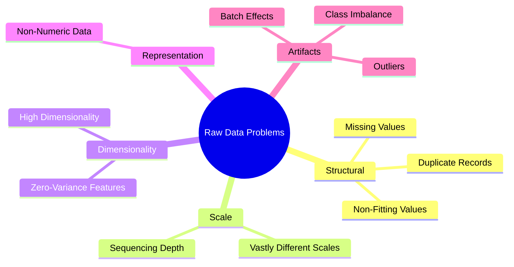

# Data Preprocessing & Feature Engineering: A Theory Primer

## What is Data Preprocessing?
Machine learning algorithms process numerical matrices; they do not inherently understand biological context. 

**Data Preprocessing** is the crucial step of cleaning, translating, and transforming raw biological data into a structured mathematical format that an algorithm can process without being misled by artifacts or noise.

---

## Why Do We Need Data Preprocessing?

A model is only as reliable as the data provided to it. Below are the five major categories of problems found in raw biological data, alongside general analogies and biological realities.

### 1. Structural & Formatting Problems (The "Dirty Data")
Data that is broken, missing, or in the wrong format.

*   **Missing Values (`NaN`, `NULL`)**
    *   *General Example (House Prices):* Predicting a house's price, but the "Number of Bedrooms" field is blank because the data was omitted during entry.
    *   *Biological Example:* A single-cell RNA sequencer fails to capture a rare gene transcript, leaving a blank (`NaN`) in the expression matrix (known as a Technical Dropout).
*   **Invalid Values (Infinities, Text in Math)**
    *   *General Example (Apples vs. Oranges):* A weight sensor erroneously records `<10g` or `"Error"` instead of a strict numerical value, breaking downstream mathematical equations.
    *   *Biological Example:* Spreadsheet software automatically converting the gene symbol `SEPT1` into the date `September 1st`, or division by zero when calculating log-fold changes, resulting in an `Inf` (Infinity) value.
*   **Duplicate Records**
    *   *General Example (House Prices):* A house is listed twice in a database. A model observing it twice becomes falsely confident about that specific house profile.
    *   *Biological Example:* A patient's tumor sample is accidentally appended twice to the database, artificially inflating the model's confidence in that specific patient's mutation profile.

### 2. Distribution & Scale Problems (The "Algorithmic Confusion")
Algorithms calculate weights based on the magnitude of numbers.

*   **Vastly Different Scales**
    *   *General Example (House Prices):* "Square Footage" is recorded in thousands (e.g., $2,500$ sq ft), while "Number of Bedrooms" is a single digit (e.g., $3$). An algorithm may falsely weigh Square Footage as $1,000\times$ more important simply because the numerical magnitude is larger.
    *   *Biological Example:* A structural "housekeeping" gene naturally expresses at $50,000$ copies, while a crucial disease-causing transcription factor expresses at $5$ copies. The model may suppress the signal of the transcription factor. Features must be scaled (e.g., Z-score standardization) so they are evaluated proportionally.
*   **Sequencing Depth / Library Size Discrepancies**
    *   *Biological Example:* Patient A's biopsy was sequenced to a depth of 20 million reads; Patient B's to 5 million reads. Raw gene counts must be normalized (e.g., $\log_2(\text{CPM}+1)$) to adjust for library size before they can be compared.

### 3. Dimensionality & Signal-to-Noise Problems (The "Curse")
Datasets containing excessive irrelevant information.

*   **Zero-Variance Features**
    *   *General Example (House Prices):* A dataset where every single house has a roof. Since the value is identical across all rows, it provides no discriminatory power to predict differences in price.
    *   *Biological Example:* A gene that is expressed at the exact same level across all healthy and diseased patients. It provides zero predictive value and only increases computational overhead.
*   **The $p \gg n$ Problem (High Dimensionality)**
    *   *General Example (House Prices):* Predicting the price of 10 houses using 20,000 features (e.g., color of the mailbox, number of blades of grass). The model will memorize noise (overfitting).
    *   *Biological Example:* Analyzing $20,000$ gene expression features ($p$) across a cohort of only $100$ patient samples ($n$). Feature selection is required to filter out non-informative genes.

### 4. Representation Problems (The "Language Barrier")
When predictive data is not naturally numerical.

*   **Non-Numeric Data (Sequences & Categories)**
    *   *General Example (Apples vs Oranges):* The color of a fruit is recorded as the string "Red" or "Orange". Mathematical models require numeric encoding (e.g., $1 = \text{Red}$, $0 = \text{Orange}$).
    *   *Biological Example:* Machine learning architectures cannot directly process the DNA sequence `ATGC`. The sequence must be translated into mathematical tensors using techniques such as One-Hot Encoding or $k$-mer frequency profiling.

### 5. Artifact & Bias Problems (The "Illusion of Biology")
When the data contains patterns that reflect technical noise rather than biological signals.

*   **Outliers**
    *   *General Example (House Prices):* A \$50 million mansion is inadvertently included in a dataset of average suburban homes, violently skewing the statistical mean.
    *   *Biological Example:* A tissue sample that degraded prior to sequencing, resulting in erratic RNA counts compared to the rest of the cohort.
*   **Batch Effects**
    *   *General Example (Apples vs Oranges):* All apples were photographed in daylight, and all oranges were photographed at night. The model learns to detect "lighting conditions" rather than fruit characteristics.
    *   *Biological Example:* Patient cohort A was sequenced on a Tuesday by Technician 1; cohort B was sequenced on a Friday by Technician 2. The model learns the technician's variance rather than the underlying disease biology.
*   **Severe Class Imbalance**
    *   *General Example (House Prices):* Attempting to learn the characteristics of mansions when the dataset contains $9,990$ regular homes and only $10$ mansions.
    *   *Biological Example:* A variant database where $99\%$ of genetic mutations are benign and $1\%$ are pathogenic. A model can achieve $99\%$ accuracy simply by classifying every variant as benign, rendering it clinically useless.
