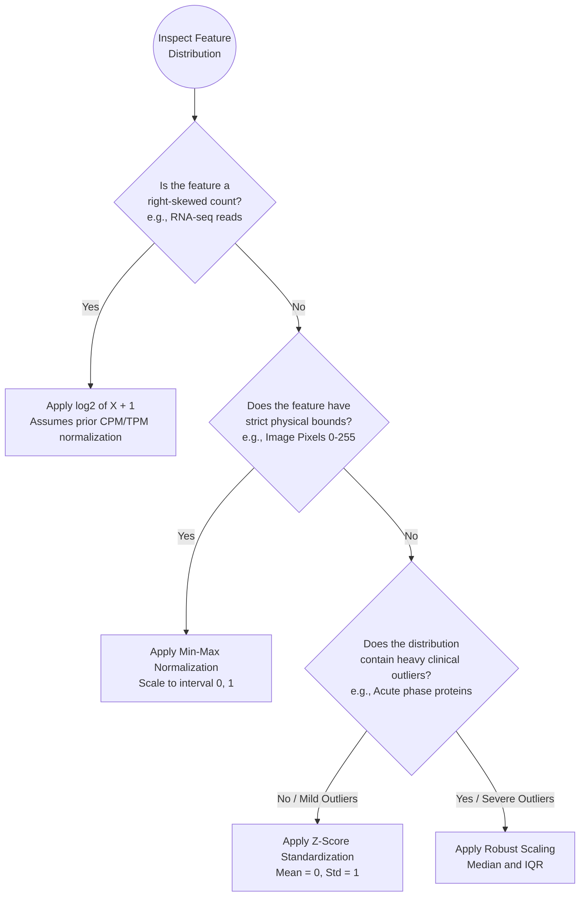

# 🧬 Data Transformations: A Foundations Primer

## What is a Data Transformation?

A **Data Transformation** is the process of applying a mathematical function to numerical features to change their scale, center, or distribution shape. Its goal is to place diverse biological measurements onto a fair, comparable scale so that machine learning algorithms can analyze patterns accurately without being dominated by raw numerical magnitudes or differing units of measurement.

---

## Why Numerical Features Require Transformation

Consider two routine clinical measurements recorded for an individual patient:
* **Age:** $45\text{ years}$
* **Platelet count:** $250,000\text{ cells/}\mu\text{L}$

From a medical perspective, both values represent normal physiological findings. However, to a machine learning algorithm, these entries exist merely as raw numerical quantities. Because $250,000$ is orders of magnitude larger than $45$, distance-based algorithms (such as $k$-Nearest Neighbors, Support Vector Machines, and $K$-Means clustering) and gradient-driven models will prioritize the platelet count, effectively treating patient age as negligible noise.

```
Raw Data (Disproportionate)       ──>   Mathematical Transformation   ──>   Balanced Data
Age: 45                                 [Standardization / Scaling]         Age: +0.2
Platelets: 250,000                                                          Platelets: +0.4
(Algorithm overweights platelets)                                           (Both features contribute equally)
```

### Biological Normalization vs. Machine Learning Transformation

It is essential to distinguish between two distinct stages in bioinformatics workflows:

1. **Biological / Technical Normalization (Upstream):** Corrects for experimental artifacts, sequencing depth, and technical batch differences (e.g., converting raw read counts into Counts Per Million [$\text{CPM}$], Transcripts Per Million [$\text{TPM}$], or using DESeq2/edgeR median-of-ratios).
2. **Machine Learning Data Transformation (Downstream):** Adjusts the statistical distribution (scaling, centering, variance stabilization) of biologically normalized values so that mathematical optimization algorithms operate efficiently and without feature dominance.

> [!IMPORTANT]
> **Zero Data Leakage Invariant**  
> Transformation parameters—such as the mean ($\mu$) and standard deviation ($\sigma$) for Z-score scaling, the minimum and maximum for Min-Max normalization, or the median and IQR for Robust scaling—must **always** be calculated exclusively on the **training set**. Those exact fitted parameters are then used to transform validation and test sets. Fitting scalers across an entire dataset prior to splitting leaks test information into training and produces over-optimistic performance estimates.

---

## 1. Log Transformation

### 1. Intuitive Analogy
Consider measuring personal wealth across a major metropolitan city. Most residents earn between $\$30,000$ and $\$80,000$ per year, but a handful of residents are multi-billionaires. If we plot these incomes on a standard linear scale, the billionaire incomes stretch the axis so far that all ordinary working salaries are crushed into an indistinguishable spike at zero. 

A **logarithmic transformation** compresses giant runaway numbers while stretching out small numbers. It turns exponential jumps ($10$, $100$, $1,000$) into steady, additive steps ($1$, $2$, $3$), pulling extreme values inward so the full distribution can be examined and modeled.

### 2. Biological Framing
In RNA sequencing ($\text{RNA-seq}$) and single-cell genomics, transcript count distributions are heavily right-skewed. Highly expressed structural genes (such as actin, tubulin, or ribosomal proteins) often yield hundreds of thousands of reads, whereas regulatory transcription factors may yield only $5$ to $10$ reads. Without transformation, the structural genes dominate the model's loss function, obscuring subtle regulatory signals.

### 3. Terminology & Conventions
* **Pseudocount ($+1$):** Because $\log(0)$ is mathematically undefined ($\lim_{x \to 0^+} \log(x) = -\infty$), an offset of $+1.0$ is added to all values before taking the logarithm. Zero reads remain zero after transformation: $\log_2(0 + 1) = \log_2(1) = 0.0$.
* **Base 2 Convention ($\log_2$):** Base 2 is the standard convention in bioinformatics because a unit change of $+1.0$ corresponds directly to a **two-fold biological increase** (doubling of expression), while a change of $-1.0$ represents a **two-fold biological decrease** ($50\%$ reduction or halving).

### 4. Minimal Math
$$\text{Transformed Value} = \log_2(X + 1)$$

### 5. Code Implementation
```python
import numpy as np

# Simulated gene expression values (CPM-normalized)
raw_cpm = np.array([0.0, 1.0, 3.0, 7.0, 15.0, 255.0, 1023.0])

# Compute log2 with a pseudocount of 1
log2_transformed = np.log2(raw_cpm + 1.0)
print("Raw CPM:       ", raw_cpm)
print("log2(CPM + 1): ", log2_transformed)
# Output: [0.  1.  2.  3.  4.  8. 10.]
```

---

## 2. Z-Score Standardization

### 1. Intuitive Analogy
Consider recording human height across a cohort that includes both adult males and adult females. A raw height of **$175\text{ cm}$** has very different biological interpretations depending on the baseline population:
* For an adult male, $175\text{ cm}$ sits near the population average.
* For an adult female, $175\text{ cm}$ represents an exceptionally tall, upper-percentile measurement.

If an algorithm evaluates only the raw number ($175\text{ cm}$), it measures absolute physical magnitude while missing how typical or extreme that value is relative to its baseline group. 

**Standardization** converts raw measurements into standardized deviation units ($Z$-scores):
* A value exactly at the group average becomes **$0.0$**.
* A value noticeably above average receives a **positive score** (e.g., $+2.0$).
* A value below average receives a **negative score** (e.g., $-1.5$).

### 2. Biological Framing
Consider a diagnostic panel measuring two biomarker genes across patient blood samples:
* **Gene A (Housekeeping gene):** Baseline expression around $50,000$ counts ($\sigma = 2,000$).
* **Gene B (Signaling receptor):** Baseline expression around $20$ counts ($\sigma = 4$).

If a disease causes both genes to deviate by two standard deviations from their normal state, Gene A shifts by $4,000$ counts while Gene B shifts by only $8$ counts. Distance-based algorithms (such as PCA projections, SVMs, or $K$-Means clustering) would track almost entirely Gene A because $4,000 \gg 8$. Standardizing gives both biological signals equal statistical standing.

### 3. Terminology & Properties
* **Centering:** Subtracting the sample mean ($\mu$) so the transformed feature is centered at $0.0$.
* **Scaling to Unit Variance:** Dividing by the sample standard deviation ($\sigma$) so the transformed feature has a variance and standard deviation of $1.0$.

### 4. Minimal Math
$$Z = \frac{x - \mu}{\sigma}$$

Where:
* $x$ is the raw feature value
* $\mu$ is the training sample mean: $\mu = \frac{1}{n}\sum_{i=1}^n x_i$
* $\sigma$ is the training sample standard deviation: $\sigma = \sqrt{\frac{1}{n}\sum_{i=1}^n (x_i - \mu)^2}$

### 5. Code Implementation
```python
from sklearn.preprocessing import StandardScaler

# Patient biomarker matrix: [Gene A, Gene B]
patient_data = [[48000.0, 16.0],
                [50000.0, 20.0],
                [52000.0, 24.0]]

scaler = StandardScaler()
standardized_data = scaler.fit_transform(patient_data)

print("Standardized Matrix (Mean = 0, Std = 1):\n", standardized_data.round(2))
# Result: Both features have equal numerical influence
```

---

## 3. Min-Max Normalization

### 1. Intuitive Analogy
Consider grading examinations across different subjects with different total possible marks. A chemistry quiz is scored out of $40$ total points, while a biology final exam is scored out of $100$ points. Scoring $36$ points on the chemistry quiz ($90\%$) reflects stronger mastery than scoring $70$ points on the biology exam ($70\%$), even though $70 > 36$ numerically. 

**Min-Max Normalization** converts both score distributions into a uniform scale from $0.0$ ($0\%$, lowest score) to $1.0$ ($100\%$, highest score), allowing direct mathematical comparison regardless of the original total point scale.

### 2. Biological Framing
Min-Max normalization is primary in digital pathology, fluorescence microscopy, and medical imaging. Hardware detectors (such as whole-slide digital scanners) record light intensity on a fixed, physically bounded scale:
* An 8-bit image detector records pixel brightness strictly from $0$ (pure black, no light) to $255$ (maximum sensor saturation).

Because physical sensor detectors cannot register below $0$ or above $255$, these measurements possess known, bounded biological minimums and maximums without open-ended outliers. Rescaling pixel arrays into $[0.0, 1.0]$ provides numerical stability when training artificial neural networks and convolutional vision architectures.

### 3. Terminology & Properties
* **Bounded Range:** All values are compressed strictly between a specified minimum (typically $0.0$) and maximum (typically $1.0$).
* **Sensitivity to Outliers:** If unexpected outliers exist outside the expected range, they become the new extremes ($0.0$ or $1.0$) and compress all normal data into a narrow band. Therefore, Min-Max normalization is reserved for features with established, natural bounds.

### 4. Minimal Math
$$X_{\text{norm}} = \frac{x - X_{\min}}{X_{\max} - X_{\min}}$$

To scale to an arbitrary interval $[a, b]$:
$$X_{\text{scaled}} = a + \frac{(x - X_{\min})(b - a)}{X_{\max} - X_{\min}}$$

### 5. Code Implementation
```python
from sklearn.preprocessing import MinMaxScaler

# Pixel intensities from an 8-bit digital pathology scanner
pixel_intensities = [[0.0], [64.0], [128.0], [255.0]]

minmax_scaler = MinMaxScaler(feature_range=(0, 1))
normalized_pixels = minmax_scaler.fit_transform(pixel_intensities)

print("Normalized Pixel Intensities [0, 1]:\n", normalized_pixels.ravel())
# Output: [0.   0.25 0.5  1.  ]
```

---

## 4. Robust Scaling (Median & IQR)

### 1. Intuitive Analogy
Consider calculating the average score for a classroom of ten students. If nine students score between $72\%$ and $80\%$, but one student accidentally receives a typo entry of $1,000\%$, the arithmetic mean is pulled dramatically upward, and the standard deviation explodes. 

In contrast, the **median** ($50\text{th}$ percentile) and the **Interquartile Range** ($\text{IQR}$, the middle $50\%$ of the class) remain virtually unaffected by the extreme score. When datasets contain extreme, genuine values that cannot be removed, **Robust Scaling** recalibrates the data using these resilient order statistics rather than fragile means and standard deviations.

### 2. Biological Framing
In clinical biochemistry, patient cohorts frequently exhibit extreme biological outliers due to acute medical emergencies. A clear example is **serum C-reactive protein (CRP)**, a clinical biomarker of systemic inflammation:
* **Healthy baseline:** $0.5\text{ to }3.0\text{ mg/L}$
* **Mild viral illness:** $5.0\text{ to }15.0\text{ mg/L}$
* **Severe bacterial sepsis / septic shock:** values can exceed $350.0\text{ mg/L}$

If we apply `StandardScaler` to this cohort, the severe septic spike pulls the mean ($\mu$) high into double digits and explodes the standard deviation ($\sigma$). As a result, the subtle, medically meaningful difference between a healthy patient ($1.0\text{ mg/L}$) and a mild viral infection ($10.0\text{ mg/L}$) is squashed into a microscopic fraction of a Z-score near zero. **Robust Scaling** preserves the variance of the healthy and mildly ill patients while accommodating the acute clinical spike.

### 3. Terminology & Properties
* **Median ($Q_2$ / $50\text{th}$ percentile):** The middle value of the sorted distribution.
* **Interquartile Range ($\text{IQR}$):** The difference between the $75\text{th}$ percentile ($Q_3$) and the $25\text{th}$ percentile ($Q_1$), representing the spread of the middle $50\%$ of observations.
* **Outlier Resilience:** Because order statistics ignore the numerical magnitude of the top and bottom $25\%$ of observations, extreme values do not distort the central scaling factor.

### 4. Minimal Math
$$X_{\text{robust}} = \frac{x - \text{median}}{\text{IQR}} = \frac{x - Q_2}{Q_3 - Q_1}$$

### 5. Code Implementation
```python
from sklearn.preprocessing import RobustScaler

# Serum CRP concentrations (mg/L) containing acute septic shock spikes
crp_cohort = [[0.8], [1.2], [1.9], [2.5], [3.1], [320.0], [350.0]]

robust_scaler = RobustScaler()
scaled_crp = robust_scaler.fit_transform(crp_cohort)

print("Robust Scaled CRP Values:\n", scaled_crp.round(2).ravel())
# Baseline differences between 0.8 and 3.1 remain distinguishable;
# extreme spikes remain separate without distorting the cohort's scale.
```

---

## 5. Decision Framework: Selecting the Appropriate Method

Selecting the appropriate data transformation depends on the underlying statistical distribution of the feature, the presence of outliers, and the requirements of downstream algorithms:



### Core Transformation Methods: Comparative Summary

| Transformation Method | Plain-English Purpose | Intuitive Analogy | Biological Application | Scikit-Learn Class / Tool |
| :--- | :--- | :--- | :--- | :--- |
| **1. Log Transformation** | Compresses massive values and expands small values to tame extreme right-skewed distributions. | **Wealth Distribution:** Compressing billionaire fortunes so ordinary salaries remain visible and comparable. | Gene expression read counts ($\text{RNA-seq}$, single-cell count matrices). | `np.log2(X + 1)` or `FunctionTransformer(np.log1p)` |
| **2. Z-Score Standardization** | Centers values at $0.0$ and scales to unit variance so all features contribute equally to distance metrics. | **Mixed-Cohort Heights:** Assessing whether $175\text{ cm}$ is average or extreme relative to a group's baseline rather than raw centimeters. | Continuous clinical lab measurements, normalized microarray matrices. | `StandardScaler()` |
| **3. Min-Max Normalization** | Rescales values strictly into a bounded interval (typically $[0, 1]$). | **Exam Percentages:** Converting exams with different point totals ($40$ vs. $100$) into uniform percentage scores ($0\%$ to $100\%$). | Digital pathology microscopy images, automated flow cytometry sensor channels. | `MinMaxScaler(feature_range=(0, 1))` |
| **4. Robust Scaling** | Centers data by the median and scales by the Interquartile Range ($\text{IQR}$) to resist extreme spikes. | **Class Median:** Calculating typical test performance without allowing one erroneous $1,000\%$ grade to distort the cohort average. | Clinical laboratory blood panels with genuine acute disease spikes (e.g., CRP, troponin). | `RobustScaler()` |

### Quick Reference Rules

1. **High-throughput Sequencing Counts ($\text{RNA-seq}$, Metagenomics):** Apply $\log_2(X + 1)$ (after library depth normalization like CPM or TPM) to stabilize variance across orders of magnitude.
2. **Continuous Physiological Features without Severe Outliers:** Apply **Z-Score Standardization** (`StandardScaler`) to provide zero-centered symmetry for linear models, SVMs, and PCA.
3. **Clinical Lab Biomarkers with Acute Disease Spikes:** Apply **Robust Scaling** (`RobustScaler`) so that severe biological outliers do not crush baseline healthy variance toward zero.
4. **Imaging & Bounded Sensor Data:** Apply **Min-Max Normalization** (`MinMaxScaler`) to restrict values within $[0.0, 1.0]$ for neural network stability.

---

## 6. Next Steps: Hands-On Practice

Now that we have explored the theoretical motivations, mathematical foundations, and decision criteria for data transformations, open the companion interactive notebook:

👉 **Interactive Notebook:** [1.2_data_preprocessing_part_b.ipynb](1.2_data_preprocessing_part_b.ipynb)

In the notebook, we will implement these four transformations on synthetic and real biological datasets, inspect diagnostic before-and-after distribution curves, and complete the *Student Challenge: Multi-Omics Patient Matrix Preparation*.
