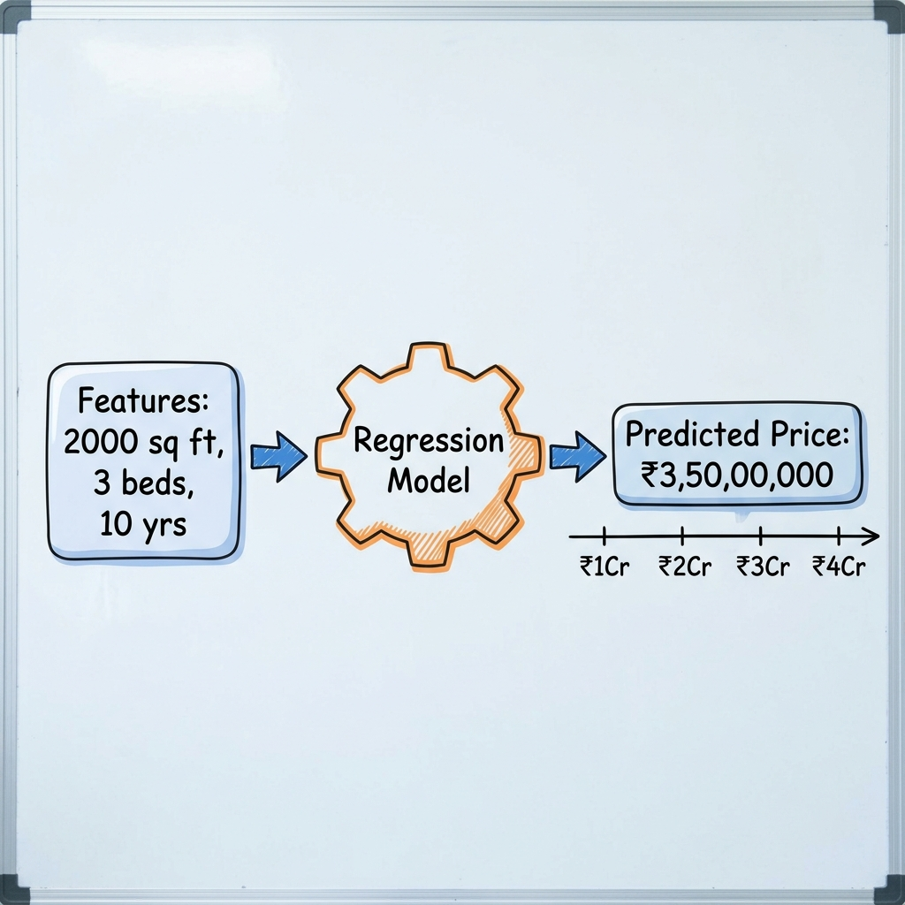
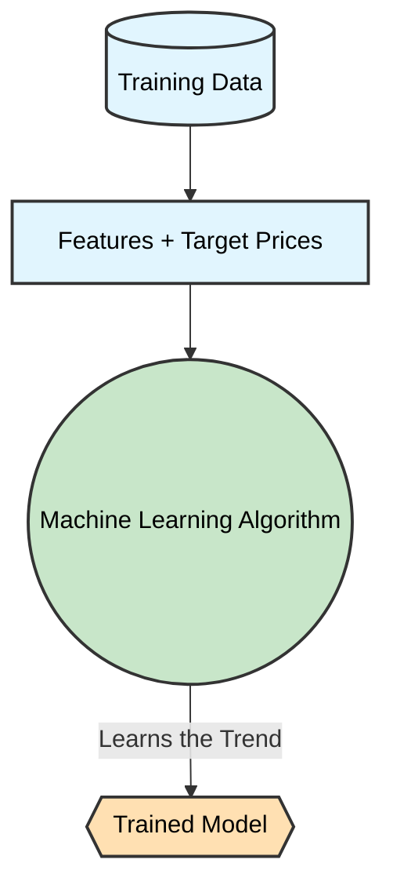
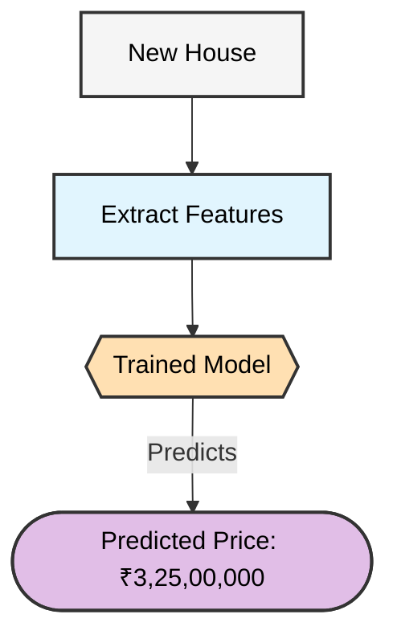
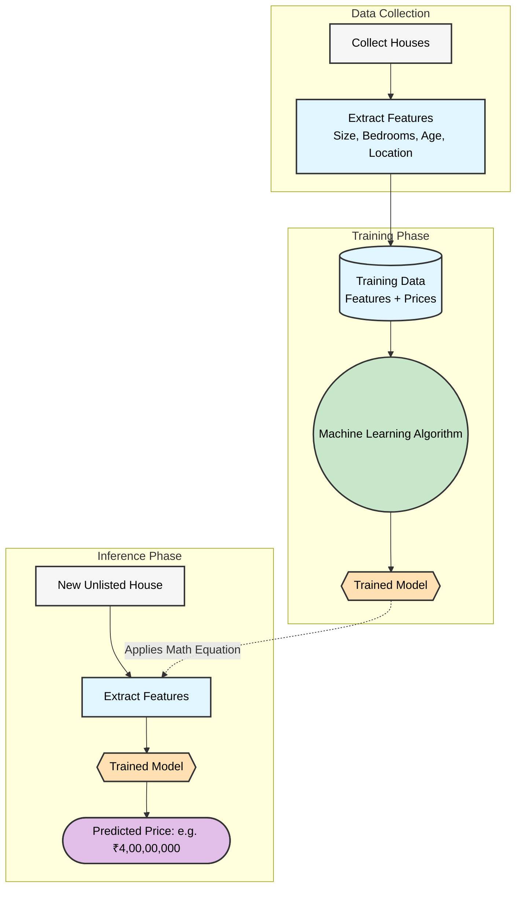

# Section 1 — How Do We Predict the Price of a House?

### 1. The Problem

Imagine that we are looking at a house for sale and asked a simple question:

> **“How much is this house worth?”**

As humans, we naturally look at the property and make an estimate based on its characteristics and our knowledge of the local real estate market.

### 2. What Do We Look At?

We rely on different attributes of the house to figure out its value:
* **Size (Square footage)**
* **Number of Bedrooms**
* **Number of Bathrooms**
* **Age of the House**
* **Location**

In Machine Learning, these characteristics are called **features**.

> 💡 **Features** are the measurable properties (the clues) that help us make a prediction.

### 3. Using Features to Make a Prediction

Let's organize our observations into a structured table. Notice how the features line up:

| Size (sq ft) | Bedrooms | Bathrooms | Age (Years) | ➡️ | Estimated Price |
| -----------: | -------: | --------: | ----------: |:---:| --------------: |
| 2,000        | 3        | 2         | 10          | ➡️ | **₹3,50,00,000**    |
| 1,200        | 2        | 1         | 45          | ➡️ | **₹1,80,00,000**    |
| 3,500        | 4        | 3         | 2           | ➡️ | **₹6,50,00,000**    |

We look at these features and use them to estimate the final price of the house.

### 4. What Is the Answer?

The final answer we are trying to predict (the House Price) has a special name. 
This answer is called the **label** or **target**. 

### 5. Regression

Because our possible answer is a **continuous number** (it could be ₹3,50,00,000, or ₹350,001, or ₹400,500) rather than a predefined category, we are performing a different type of task than classification.

When we use features to predict a specific continuous number, we are performing **regression**.

> 💡 **Regression** means predicting a continuous numerical value based on input features.

---

### Human Learning vs. Machine Learning

**Humans** learn to estimate house prices through life experience. By browsing 99acres, talking to real estate agents, or buying homes, we gradually learn that bigger houses generally cost more, and older houses might cost less (unless they are historic!). We don't need to write down a massive math equation; our brain learns the general pricing trend automatically.

**A machine** can also learn from examples, but it needs structured data. A machine is given measurable features (numbers representing square footage, bedrooms, age). When we provide many examples of houses along with their *actual sale prices*, the **machine learning algorithm** finds the hidden mathematical equation that links the size and age to the price. It then builds a **model** capable of predicting the price of a brand new, unlisted house!

In simple terms:
> **Natural learning:** Humans learn trends from experience.
> **Machine learning:** Machines learn trends from data.

---
# Section 2 — Connecting the Example to Machine Learning

Now consider the same problem from the perspective of a computer. 

Instead of manually guessing a price, we just provide the computer with many historical examples of houses that have already sold.

| Size (sq ft) | Bedrooms | Bathrooms | Age (Years) | ➡️ | Target Price    |
| -----------: | -------: | --------: | ----------: |:---:| --------------: |
| 2,000        | 3        | 2         | 10          | ➡️ | **₹3,50,00,000**    |
| 2,100        | 3        | 2         | 12          | ➡️ | **₹3,40,00,000**    |
| 1,200        | 2        | 1         | 45          | ➡️ | **₹1,80,00,000**    |
| 3,500        | 4        | 3         | 2           | ➡️ | **₹6,50,00,000**    |

The computer receives **features along with their correct numerical targets**. This collection of historical examples is called **training data**.

### The Learning Phase

The algorithm analyzes the training data to find the mathematical trend (the line of best fit).

The **model** is the mathematical equation (e.g., $Price = 100 \times Size - 500 \times Age$) generated by the algorithm learning patterns from the training data.

### The Prediction Phase

Now, when a brand new, unlisted house is presented:

Because the model learned from examples where the correct target prices were *already provided* by past sales, this process is still **Supervised Learning**. But because the prediction is a continuous number, this is specifically a **Regression** problem.

### The Complete Picture

Here is the entire end-to-end Machine Learning pipeline for our Housing Price problem. Notice how the colors and shapes remain identical to our classification example:

> 🎯 **Summary:** We used **Supervised Learning** to build a **Regression** model that maps physical house **Features** to a predicted **Numerical Target (Price)**.
