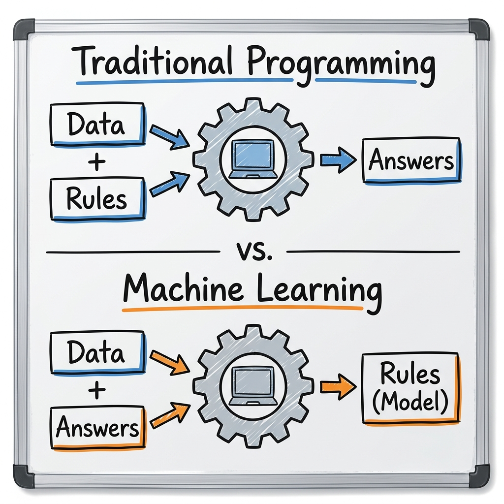
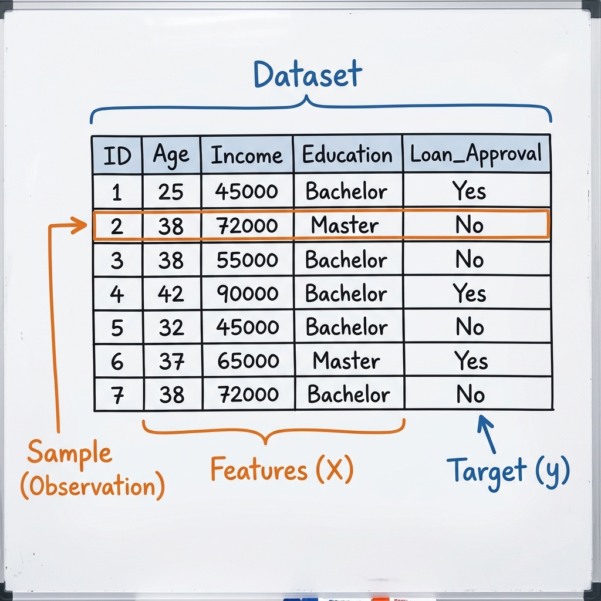
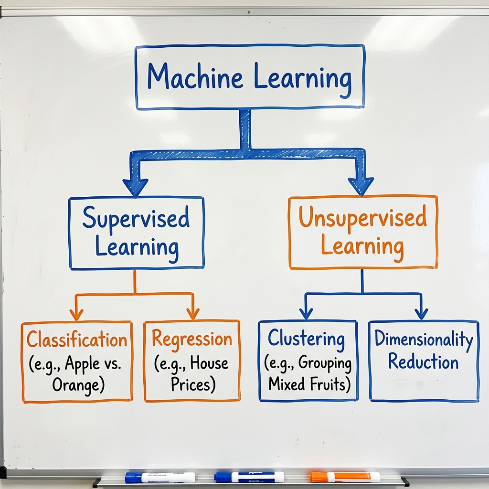

# Machine Learning Theory Primer: The Basics

*A quick, code-free guide to understanding the core concepts of Machine Learning before we dive into the practical exercises.*

---

## 1. What is Machine Learning, Really?

To understand Machine Learning, it is easiest to compare it to the way we usually write computer programs:

*   **Traditional Programming:** A human programmer writes explicit rules (code) that process input data to produce a desired output. The computer simply follows the strict, step-by-step instructions provided by the human.
    > **Data + Rules ➡️ Answers**

*   **Machine Learning:** The computer is given input data along with the correct historical answers. A machine learning algorithm analyzes this data to automatically discover the hidden patterns, creating its own rules without being explicitly programmed by a human.
    > **Data + Answers ➡️ Rules (Model)**

**The Biology Translation:**
Biological systems are often too complex for strict rulebooks. We cannot write a simple mathematical IF/THEN statement to accurately predict how a patient will respond to a drug or to detect a tumor in an MRI. Instead, we use Machine Learning: we provide the algorithm with massive amounts of historical patient data, and it learns the complex biological patterns on its own.

---

## 2. The Core Vocabulary (Plain English)
As you progress through the course, you will encounter specific vocabulary. Let's define the core terms now:

*   **Dataset:** The spreadsheet. The raw information we collected (e.g., blood test results from 500 patients).
*   **Sample (or Observation):** A single row in the dataset. An individual instance of data (e.g., one specific patient's profile and their test results).
*   **Feature ($X$):** The clues. The inputs we feed the machine (e.g., patient age, gene expression levels, fasting hours). 
*   **Target (or Label, $y$):** The answer. What we are trying to predict (e.g., Does the patient have diabetes? Yes or No).
*   **Model:** The math equation that gets created *after* the machine has looked at all the clues and answers. It is the "brain" we save and use on future patients.

---

## 3. Supervised vs. Unsupervised Learning

### Supervised Learning (Learning with a Teacher)
We give the computer the Features (clues) **AND** the Targets (answers). 
*   *Example:* We give the computer 1,000 images of cells. We explicitly tell the computer, *"These 500 are healthy, these 500 are cancerous."* The computer learns the difference.

**Two Types of Supervised Learning:**
1.  **Classification:** Predicting a specific category or class *(e.g., Is this tumor Benign or Malignant?)*
    *   👉 **[Dive Deeper: Natural vs. Artificial Learning (Classification)](./Day2_DeepDive_Classification.md)**
2.  **Regression:** Predicting a continuous numerical value *(e.g., What is the exact price of this house?)*
    *   👉 **[Dive Deeper: Natural vs. Artificial Learning (Regression)](./Day2_DeepDive_Regression.md)**

### Unsupervised Learning (Learning without a Teacher)
We give the computer the Features (clues), but **NO** Targets (answers). The computer has to find hidden structure on its own without predefined labels.

**Two Types of Unsupervised Learning:**
1.  **Clustering:** Discovering hidden groupings within unlabeled data *(e.g., Grouping mixed fruits or unknown viruses)*. It helps us discover things we didn't even know existed (like finding a brand new subtype of cancer).
    *   👉 **[Dive Deeper: Natural vs. Artificial Learning (Unsupervised Clustering)](./Day2_DeepDive_Unsupervised.md)**
2.  **Dimensionality Reduction:** Compressing massive, complex datasets down to their most important features so humans can visualize them *(e.g., Visualizing 20,000 genes on a simple 2D plot)*.

---

## 4. Why are we doing this in Bioinformatics? (The Problem of Scale)
Why can't we just use normal statistics in biology?
Because of **Scale**. 
If a patient gets a basic blood test for 5 things (cholesterol, glucose, etc.), a doctor can look at it and make a diagnosis. 
But if we sequence a patient's genome, we are looking at **20,000 genes simultaneously**. The human brain cannot comprehend a spreadsheet with 20,000 columns. Machine Learning algorithms are the *only* mathematical tools capable of finding patterns in biological data that massive.
