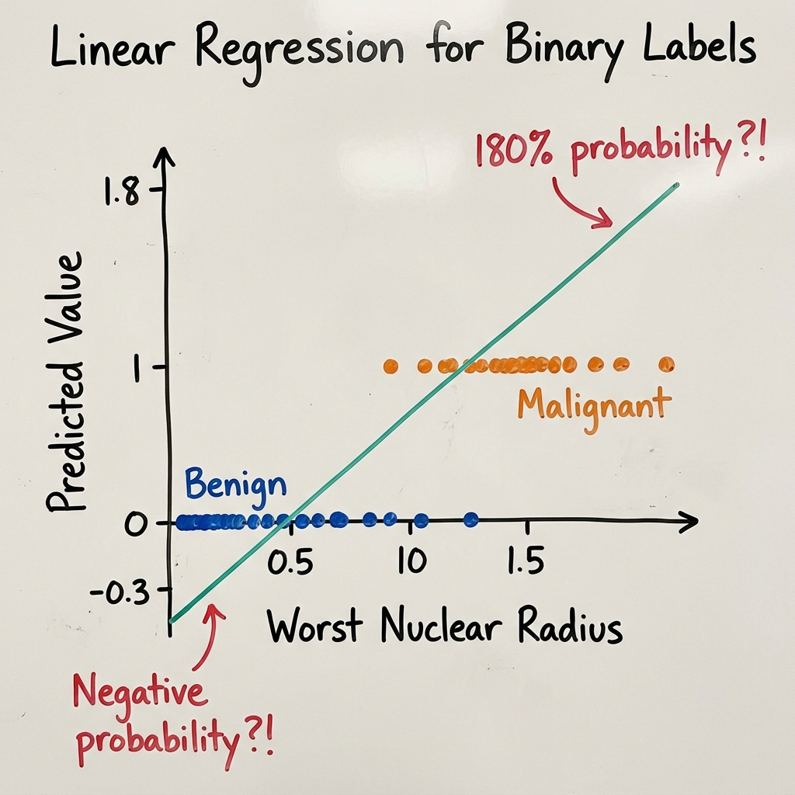
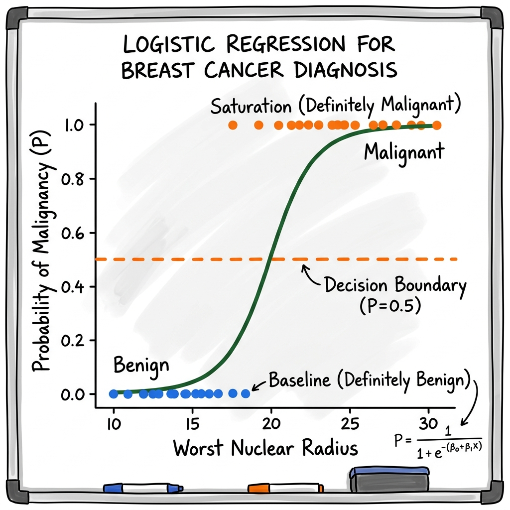

# 🧬 Classification Models: Predicting Biological Categories & States

In our previous primer on Regression, we learned how to predict a *continuous* numerical value — a patient's progression-free survival in months, or the $IC_{50}$ concentration of a drug. But what happens when the biological question doesn't have a numerical answer along a continuous spectrum?

In molecular pathology and clinical diagnostics, the most critical questions have discrete categorical answers:
* *"Based on nuclear geometry from a biopsy, is this tumor **Benign (0)** or **Malignant (1)**?"*
* *"Will this leukemia patient **Respond (1)** or **Relapse (0)** on targeted immunotherapy?"*
* *"Is this candidate sequence a transcription factor **Binding Site** or **Non-Binding** DNA?"*

This primer covers the three foundational algorithms we use when the "answer key" is a category or discrete biological state:

```
                       CLASSIFICATION MODELS
              (Predicting Discrete Biological Categories)
                                  │
           ┌──────────────────────┼──────────────────────┐
           ▼                      ▼                      ▼
 LOGISTIC REGRESSION        DECISION TREES         RANDOM FORESTS
(Probability Curves)    (Clinical Flowcharts)  (Committee of Experts)
 • Sigmoid/S-curves      • IF/THEN rules        • Ensemble voting
 • Odds Ratios           • Gini Impurity        • Variance reduction
 • Risk probabilities    • Single thresholds    • Biomarker discovery
```

---

## 📋 Session 09 & 10 Curriculum Roadmap: Classification Track

Supervised learning models learn mathematical mappings from input features ($\mathbf{X}$) to known ground-truth targets ($y$). In this track of our core supervised models curriculum, we master predicting **discrete biological categories and clinical states**:

```text
┌───────────────────────────────────────────────────────────────────────────────────────────┐
│                      SESSIONS 09 & 10: CLASSIFICATION CURRICULUM ROADMAP                  │
├───────────────────────────────────────────────────────────────────────────────────────────┤
│ 1. Foundations & Recap                                                                    │
│    • Supervised Learning paradigm: Feature matrix X → Categorical target vector y         │
│    • Continuous targets (Regression) vs. Discrete categories (Classification)             │
│    • Administrative: Submitting takeaway challenges via browser-based GitHub Issues       │
├───────────────────────────────────────────────────────────────────────────────────────────┤
│ 2. Core Theory (This Primer)                                                              │
│    • Logistic Regression: Binary labels, Sigmoid curve σ(z), Odds Ratios, threshold τ    │
│    • Decision Trees: Clinical flowcharts, Gini Impurity, IF/THEN rules, overfitting       │
│    • Random Forests: Committee of experts, Bagging, √p subspacing, feature importance     │
│    • Multi-Model Validation: ROC-AUC curves, Confusion Matrices, clinical tradeoffs       │
├───────────────────────────────────────────────────────────────────────────────────────────┤
│ 3. Hands-On Practical ([2.1_classification_models.ipynb](2.1_classification_models.ipynb)) │
│    • 1. Logistic Regression:                                                              │
│         - Linear boundary failure vs. Sigmoid S-curve (Pilot FNA cohort, n=8)             │
│         - Multi-biomarker model & clinical Odds Ratios (exp(w))                           │
│    • 2. Decision Trees:                                                                   │
│         - Depth-constrained clinical tree (max_depth=2)                                   │
│         - Rule extraction: export_text() clinical SOP & plot_tree() visual flowchart      │
│    • 3. Random Forests:                                                                   │
│         - 100-Tree Tumor Board committee ensemble & majority voting                       │
│         - Biomarker discovery: Gini Feature Importance rankings                           │
├───────────────────────────────────────────────────────────────────────────────────────────┤
│ 4. Takeaway Deliverable                                                                   │
│    • Post completed code snippet, model output, and 2-sentence biological interpretation  │
│      as a new issue on the course GitHub repository                                       │
└───────────────────────────────────────────────────────────────────────────────────────────┘
```

---

## Part 1: Biological Probabilities (Logistic Regression)

### The Clinical Question

A patient's breast biopsy cytology results arrive from the pathology lab. Using Fine Needle Aspiration (FNA) imaging (such as the Wisconsin Diagnostic Breast Cancer dataset), digital image processing extracts precise geometric measurements of cell nuclei: `mean_radius`, `mean_texture`, and `mean_concave_points`.

We have an urgent binary diagnostic question:

> **"Is this tumor Benign ($0$) or Malignant ($1$)?"**

---

### Our First Instinct: Can We Use What We Already Know?

We just spent an entire primer learning linear regression. It works beautifully for continuous predictions — survival months, drug concentrations, biological ages. So here is a natural question: **can we simply use linear regression for this binary diagnosis too?**

Let us try. Suppose we have data from 8 previous patients. For each one, histopathology has already established the ground-truth diagnosis — Benign (coded as $0$) or Malignant (coded as $1$) — alongside a single morphometric measurement, the worst nuclear radius:

| Patient | Worst Nuclear Radius ($x$, in $\mu$m) | Diagnosis ($y$) |
| :---: | :---: | :---: |
| P1 | 11.2 | $0$ (Benign) |
| P2 | 12.8 | $0$ (Benign) |
| P3 | 13.5 | $0$ (Benign) |
| P4 | 15.0 | $0$ (Benign) |
| P5 | 16.2 | $1$ (Malignant) |
| P6 | 18.5 | $1$ (Malignant) |
| P7 | 21.0 | $1$ (Malignant) |
| P8 | 24.3 | $1$ (Malignant) |

If we fit our trusted $y = w \cdot x + b$ through these eight points, linear regression will find the straight line that minimizes squared residuals — just as before. And for patients in the middle range, the predictions look reasonable: a patient with radius $16.0\,\mu\text{m}$ might get a predicted value around $0.55$.

But what happens at the extremes?

---

### Where the Straight Line Breaks

Consider a patient whose tumor cells have unusually large nuclei — say, worst radius $ >15.0\,\mu\text{m}$. The straight line keeps climbing past the data and predicts $y = 1.8$. That would mean a **$180\%$ probability of cancer.** What does $180\%$ even mean biologically?

Now consider the opposite: a patient with very small, well-organized nuclei — worst radius $= 3.0\,\mu\text{m}$. The line extends downward and predicts $y = -0.3$. That is a **$-30\%$ probability of cancer.** Negative probability is biologically meaningless.



The fundamental problem is now clear: **a straight line extends to $-\infty$ and $+\infty$, but probabilities must live between $0$ and $1$.** Linear regression has no mechanism to respect these biological boundaries.

---

### Bending the Line Into an S-Curve

So we need a way to take our familiar linear score ($z = w \cdot x + b$) and *squeeze* it into the valid probability range $[0, 1]$, no matter how extreme the input.

What shape would accomplish this? We need a function that:
* Stays near $0$ for very negative inputs (small nuclei → almost certainly benign)
* Rises steeply through the middle (the "diagnostic transition zone")
* Flattens near $1$ for very positive inputs (large nuclei → almost certainly malignant)

That shape — a gradual S-curve — should look familiar. In our polynomial regression primer, we encountered pharmacological **dose-response curves** that behave exactly this way: flat at low concentrations, a steep transition through the therapeutic window, then saturation at high concentrations as cellular receptors become fully occupied.

**Logistic Regression** uses precisely this biological S-curve — called the **Sigmoid function** ($\sigma$) — to transform an unbounded linear score into a valid probability:



No matter how large or small the input, the output is always a valid probability between $0$ and $1$. Large nuclei → $P$ approaches $1.0$ but never exceeds it. Small nuclei → $P$ approaches $0.0$ but never goes negative. Compare this to the straight line above — the S-curve solves the boundary violation problem completely.

---

### How the Sigmoid Works

The process happens in two steps that build directly on what we already know from regression:

**Step 1 — Compute the linear score** using the same weighted sum from regression:

$$z = w_1 x_1 + w_2 x_2 + \dots + w_p x_p + b = \mathbf{w}^T \mathbf{x} + b$$

**Step 2 — Pass it through the Sigmoid** to squeeze the result into $[0, 1]$:

$$P = \sigma(z) = \frac{1}{1 + e^{-z}}$$

When $z$ is a large positive number (tumor features strongly suggest malignancy), $e^{-z}$ becomes tiny, and $\sigma(z)$ approaches $1$. When $z$ is a large negative number (features suggest benign tissue), $e^{-z}$ dominates and $\sigma(z)$ approaches $0$. When $z = 0$, the model is maximally uncertain: $\sigma(0) = 0.5$.

A prediction of $P = 0.94$ means the model sees high clinical urgency — this patient should be referred for immediate surgical biopsy. A prediction of $P = 0.52$ signals a borderline case that a pathologist should examine more carefully, perhaps with secondary immunohistochemical staining.

---

### From Probabilities to Diagnoses: The Decision Threshold

The sigmoid gives us a probability. But the clinician ultimately needs a binary answer: *Benign* or *Malignant*. How do we cross that bridge?

We choose a **decision threshold** — a probability cutoff above which we diagnose malignancy. The default is $P = 0.5$:

* If $P \geq 0.5$, predict **Malignant**
* If $P < 0.5$, predict **Benign**

But this threshold is not fixed by the mathematics — it is a **clinical decision**. In cancer screening, where missing a true cancer (a False Negative) is far more dangerous than a false alarm (a False Positive), a clinician might lower the threshold to $P = 0.3$:

* At $P = 0.3$: We flag more suspicious cases for follow-up. We catch more cancers, but also trigger more unnecessary biopsies.
* At $P = 0.7$: We only flag high-confidence cases. We reduce unnecessary biopsies, but risk missing early-stage tumors.

This trade-off between catching every cancer and minimizing false alarms is the central tension in diagnostic AI. We will quantify it precisely in the Evaluation Metrics section below.

---

### What Logistic Regression Weights Reveal: Odds Ratios

In linear regression, each weight $w_j$ directly told us: *"for every 1-unit increase in this gene, survival changes by $w_j$ months."* Logistic regression weights carry a parallel interpretation — but in the language of **Odds Ratios**.

Because the model is linear in "log-odds space," exponentiating a weight gives us the factor by which the odds of disease change per unit increase in that feature. An Odds Ratio (OR $= e^{w_j}$) greater than $1$ means the feature *increases* disease risk. An OR less than $1$ means it is *protective*. An OR of exactly $1$ means the feature has no effect.

| Biomarker | Weight ($w$) | Odds Ratio ($e^w$) | What It Tells the Clinician |
| :--- | :---: | :---: | :--- |
| `BRCA1_Mutation` | $+0.916$ | $2.50$ | Patients with this mutation have **2.5× higher odds** of malignancy |
| `High_Fibronectin` | $+0.262$ | $1.30$ | Each unit increase makes malignancy **1.3× more likely** |
| `ER_Positive` (Estrogen Receptor) | $-0.916$ | $0.40$ | **Reduces odds of aggressive recurrence by 60%** — favorable prognosis |

Just as linear regression weights gave us a ranked list of candidate biomarkers by effect size, logistic regression odds ratios give us a ranked list by relative disease risk — directly interpretable by oncologists and epidemiologists.

---

## Part 2: Hard Clinical Rules (Decision Trees)

### When Smooth Curves Are Not Enough

Logistic regression models smooth, gradual transitions in risk. But clinical medicine often operates on **hard thresholds**:
* *IF* Fasting Blood Glucose $> 126\text{ mg/dL}$ → Diabetic.
* *IF* Systolic Blood Pressure $> 140\text{ mmHg}$ *AND* Age $> 60$ → High Cardiovascular Risk.

These are not gradual probability curves — they are sharp binary cutoffs codified in clinical practice guidelines. When we need an algorithm that can learn such discrete, readable rules directly from data, we need a different approach.

---

### How a Pathologist Actually Thinks

When a pathologist examines FNA cytology under a microscope, they do not mentally compute weighted sums or sigmoid curves. They follow an ordered sequence of targeted diagnostic questions:

1. *Are the cell nuclei abnormally large (worst radius $> 16.8\,\mu\text{m}$)?*
   * *If NO:* Morphology consistent with normal tissue → Likely Benign. Stop.
   * *If YES:* Proceed to the next question.
2. *Are the nuclear borders irregular — showing deep invaginations (concave points $> 0.136$)?*
   * *If YES:* Severe structural abnormality → Malignant.
   * *If NO:* Enlarged but smooth nuclei → Borderline. Order additional tests.

Each question splits the patient cohort into progressively more homogeneous sub-groups. This is exactly what a **Decision Tree** does: it automatically discovers the optimal sequence of binary questions that best separates diagnostic categories.

---

### A Clinical Decision Tree in Action

Here is an interpretable 3-level tree trained on nuclear morphometry from the Wisconsin Diagnostic Breast Cancer (WDBC) dataset:

```
                   Feature: worst_radius
                   Threshold: <= 16.8 μm
                   /                     \
            [YES] /                       \ [NO]
                 /                         \
      Feature: worst_concave_points         Feature: worst_texture
      Threshold: <= 0.136                   Threshold: <= 25.6
             /          \                          /          \
       [YES]/            \[NO]               [YES]/            \[NO]
           /              \                      /              \
    🟢 BENIGN          🔴 MALIGNANT       🟡 BORDERLINE       🔴 MALIGNANT
   (350 samples)       (42 samples)        (12 samples)       (165 samples)
```

Notice what the algorithm discovered on its own: the very first question it asks — `worst_radius <= 16.8 μm` — lines up directly with what cytopathologists look for under brightfield microscopy. The algorithm has never read a pathology textbook, yet it independently identified nuclear size as the single most informative diagnostic feature.

Reading the tree reveals its clinical structure:
* **Root Node** (the first split): Represents the **single most discriminatory cutoff** across the entire dataset.
* **Internal Nodes**: Secondary conditions that refine the diagnosis — such as checking border irregularity only among patients who already have enlarged nuclei.
* **Leaf Nodes**: Clinically distinct patient sub-populations sharing a common diagnostic profile.

---

### How Does the Tree Choose Its Questions? Gini Impurity

The model starts with all the training data in one group and looks through the available **features and possible threshold values** to find a question that can separate the classes as clearly as possible. For example, it might test questions such as *“Is `worst_radius` ≤ 16.8?”* or *“Is `mean_texture` ≤ 20?”*. After each possible split, it checks how mixed the resulting groups are using **Gini impurity**. If a split creates groups that are mostly Benign or mostly Malignant, the groups become more pure and their Gini impurity decreases. For two classes, the highest possible Gini impurity is **0.5**, which occurs when a group is 50% Benign and 50% Malignant. The tree chooses the **feature and threshold that produce the largest reduction in impurity**, and that becomes its first question. It then repeats the same process for the resulting groups.

---

### Peeking Inside: Extracting & Visualizing the Clinical Flowchart

One of the most powerful advantages of decision trees over other machine learning models is **transparency**. Unlike deep neural networks (which function as opaque "black boxes"), a trained decision tree is a fully readable clinical protocol. Pathologists, regulatory bodies (FDA, CLIA), and hospital ethics committees can inspect every split, verify that the logic is biologically sound, and audit the exact reasoning behind each diagnostic recommendation.

Scikit-learn provides two built-in tools to extract and inspect this clinical logic from a trained tree:

**Method 1 — Text-Based IF/THEN Rules (`export_text`):**

The function `sklearn.tree.export_text` converts a trained `DecisionTreeClassifier` into a human-readable ASCII text protocol. Each line represents a branching rule — the same IF/THEN logic a clinician would follow on a printed Standard Operating Procedure (SOP):

```
|--- worst_radius <= 16.80
|   |--- worst_concave_points <= 0.14
|   |   |--- class: Benign
|   |--- worst_concave_points >  0.14
|   |   |--- class: Malignant
|--- worst_radius >  16.80
|   |--- worst_texture <= 25.62
|   |   |--- class: Malignant
|   |--- worst_texture >  25.62
|   |   |--- class: Malignant
```

A cytopathologist can read this output and immediately verify: *"Yes, the algorithm's first question — nuclear radius — aligns with established morphometric criteria."* This direct auditability is critical for clinical deployment.

**Method 2 — Visual Flowchart Diagrams (`plot_tree`):**

The function `sklearn.tree.plot_tree` renders a publication-grade graphical flowchart. Each box in the diagram displays:
1. The biomarker question and threshold (e.g., `worst_radius <= 16.8`)
2. The Gini impurity score at that node
3. The total number of patient samples evaluated
4. The class distribution (`[Benign, Malignant]`)
5. Node color intensity — pure blue for Benign-dominant nodes, pure orange for Malignant-dominant nodes, with intermediate shades indicating mixed populations

Both methods are demonstrated in the Practical Scikit-Learn Implementation section below.

---

## Part 3: The Committee of Experts (Random Forests)

### The Problem with a Single Tree

A single decision tree provides unmatched transparency — we can follow its logic step by step. But it has a critical weakness: **it overfits.**

Without depth constraints, a tree will keep splitting until every leaf contains just one or two samples. It memorizes not just real biological patterns but also noise, measurement artifacts, and coincidental quirks of the training cohort. A single tree might learn a rule like: *"IF cell_radius > 14.2 AND patient_age = 47 AND platelet_count = 241 → Malignant."* This achieves $100\%$ accuracy on the training data but fails when a new patient arrives from an external hospital.

---

### What Hospitals Do for Difficult Cases

In clinical oncology, a difficult biopsy is rarely diagnosed by a single physician in isolation. The hospital convenes a **Multidisciplinary Tumor Board** — a committee of pathologists, oncologists, and radiologists who independently examine the evidence and vote.

A **Random Forest** translates this institutional principle into an algorithm. Instead of one fallible tree, it builds $100$+ diverse decision trees and combines their votes.

To ensure the trees do not all make the same mistakes, the algorithm enforces two layers of diversity:

```
                      PATIENT COHORT (N Samples, P Genes)
                                      │
            ┌─────────────────────────┼─────────────────────────┐
            ▼                         ▼                         ▼
   Bootstrap Sample 1        Bootstrap Sample 2        Bootstrap Sample 100
   (Random 63% patients)     (Random 63% patients)     (Random 63% patients)
            │                         │                         │
      Random √P Genes           Random √P Genes           Random √P Genes
            │                         │                         │
            ▼                         ▼                         ▼
       [Tree 1]                  [Tree 2]                 [Tree 100]
            │                         │                         │
            └─────────────────────────┼─────────────────────────┘
                                      │
                              ENSEMBLE VOTING
                        (Majority Diagnosis Wins)
```

1. **Bootstrap Patient Sampling (Bagging):** Each tree trains on a different random sample of patients drawn with replacement — roughly $63\%$ unique patients per tree.
2. **Random Feature Subspaces:** At every split within every tree, only a random subset of features (typically $\sqrt{p}$) is considered — so each tree sees a different slice of the molecular profile.

When a new patient arrives, all $100$ trees independently cast a diagnostic vote. The majority vote wins. Individual errors and idiosyncrasies cancel out, producing stable predictions that generalize to new hospitals and cohorts.

---

### Feature Importance: Discovering Biomarkers from the Ensemble

We lose the simplicity of a single readable flowchart, but we gain something powerful for biomarker research: **Mean Decrease in Impurity (Feature Importance)**.

By tracking how much Gini Impurity drops each time a particular feature is used for a split — averaged across all $100$ trees — the algorithm produces an objective importance ranking for every measured biomarker:

```
  Ranked Biomarker Importance (Wisconsin Diagnostic Data)
  worst_concave_points  ████████████████████████████  0.28
  worst_radius          ██████████████████████        0.22
  worst_perimeter       ███████████████               0.15
  mean_texture          ██████                        0.08
  smoothness_error      █                             0.01
```

If `worst_concave_points` consistently emerges as the top feature across hundreds of randomized trees, we have strong evidence that nuclear border irregularity is the primary morphometric driver separating benign tissue from invasive carcinoma.

---

## When Is Each Classification Model the Right Tool?

| Clinical Scenario | Recommended Algorithm | Why |
| :--- | :--- | :--- |
| **Epidemiological Risk Factor Analysis** | **Logistic Regression** | Interpretable Odds Ratios for reporting molecular risk factors to clinicians and regulatory bodies |
| **Point-of-Care Bedside Diagnostics** | **Decision Tree** | Transparent IF/THEN protocol that practitioners can verify and follow manually |
| **High-Dimensional Omics Biomarker Discovery** | **Random Forest** | Handles thousands of gene features with non-linear interactions; resists overfitting |

---

## Practical Scikit-Learn Implementation

In Python, Scikit-learn provides an identical `fit`/`predict` interface across all classical classification models:

```python
import numpy as np
import matplotlib.pyplot as plt
from sklearn.linear_model import LogisticRegression
from sklearn.tree import DecisionTreeClassifier, export_text, plot_tree
from sklearn.ensemble import RandomForestClassifier
from sklearn.metrics import classification_report, roc_auc_score

# 1. Logistic Regression: Clinical Risk Probabilities & Odds Ratios
log_reg = LogisticRegression(max_iter=1000, random_state=42)
log_reg.fit(X_train, y_train)

# Extract Odds Ratios for biomarker interpretation
odds_ratios = np.exp(log_reg.coef_[0])
print("Top Biomarker Odds Ratios:", odds_ratios[:3])

# 2. Decision Tree: Interpretable Clinical Flowchart & Rule Extraction
dt_model = DecisionTreeClassifier(max_depth=3, random_state=42)
dt_model.fit(X_train, y_train)

# Extract readable IF/THEN clinical protocol rules
tree_rules = export_text(dt_model, feature_names=list(feature_names))
print("--- Extracted Clinical Flowchart Rules ---")
print(tree_rules)

# Optional: Render visual diagnostic flowchart
# plt.figure(figsize=(14, 7))
# plot_tree(dt_model, feature_names=feature_names,
#           class_names=['Benign', 'Malignant'], filled=True)
# plt.title("FNA Cytology Diagnostic Decision Tree")
# plt.show()

# 3. Random Forest: Ensemble Committee & Feature Importance
rf_model = RandomForestClassifier(n_estimators=100, max_depth=5, random_state=42)
rf_model.fit(X_train, y_train)

# Extract Gini Biomarker Importance rankings
print("Random Forest Feature Importances:", rf_model.feature_importances_[:3])

# 4. Multi-Model Clinical Validation on Held-Out Validation Split
models = {
    "Logistic Regression": log_reg,
    "Decision Tree": dt_model,
    "Random Forest": rf_model
}

for name, model in models.items():
    y_pred = model.predict(X_val)
    y_prob = model.predict_proba(X_val)[:, 1]
    print(f"\n================ {name} ================")
    print(classification_report(y_val, y_pred, target_names=['Benign', 'Malignant']))
    print(f"ROC-AUC Score: {roc_auc_score(y_val, y_prob):.3f}")
```

---

## Summary Box

| Algorithm | What It Does | Key Output | Best For |
| :--- | :--- | :--- | :--- |
| **Logistic Regression** | Bends a linear score into a probability via the Sigmoid | Predictions. Odds Ratios ($e^w$) per biomarker | Risk factor analysis, clinical reporting |
| **Decision Tree** | Learns a sequence of binary threshold questions | Predictions. Readable diagnostic flowchart | Point-of-care protocols, clinical transparency |
| **Random Forest** | Combines $100$+ diverse trees by majority vote | Predictions. Feature importance rankings | High-dimensional omics, biomarker discovery |

```
  ┌────────────────────────────────────────────────────────────────────────┐
  │                       CLASSIFICATION MODELS RECAP                      │
  ├────────────────────────────────────────────────────────────────────────┤
  │                                                                        │
  │  LOGISTIC REGRESSION                                                   │
  │  • Linear regression fails on binary labels: outputs go past [0, 1]    │
  │  • Sigmoid bends the line into an S-curve: P = 1/(1 + e⁻ᶻ)             │
  │  • Weights → Odds Ratios: OR = exp(w) for biomarker risk ranking       │
  │  • Decision threshold is a clinical choice, not a mathematical one     │
  │                                                                        │
  │  DECISION TREES                                                        │
  │  • Learns IF/THEN diagnostic rules via recursive binary splits         │
  │  • Picks splits that maximize Gini Impurity reduction                  │
  │    G = 1 - (p_benign² + p_malignant²)                                  │
  │  • Root node = single most discriminatory biomarker threshold          │
  │  • Transparent but prone to overfitting on training cohort             │
  │                                                                        │
  │  RANDOM FORESTS                                                        │
  │  • Ensemble of 100+ trees using Bagging and random feature subsets     │
  │  • Majority voting cancels individual tree errors and reduces variance │
  │  • Mean Decrease in Impurity ranks candidate clinical biomarkers       │
  └────────────────────────────────────────────────────────────────────────┘
```

---

## 📌 Hands-On Practical & Takeaway Deliverable

* **Interactive Notebook:** Transition to [2.1_classification_models.ipynb](2.1_classification_models.ipynb) to apply these algorithms directly in Python.
* **Challenge Deliverable (Submit via GitHub Issues):**
  Complete the takeaway exercise in [2.1_classification_models.ipynb](2.1_classification_models.ipynb):
  1. Open the course GitHub repository in your browser.
  2. Navigate to the **Issues** tab $\longrightarrow$ click **New Issue**.
  3. Title your issue: `[Takeaway] <Student Name> - Classification Models`
  4. Post your completed code snippet, model output (Odds Ratios, extracted IF/THEN rules, or Feature Importance ranking), and a 2-sentence clinical/biological interpretation. Submitting directly through the browser ensures an auditable record of your work without Git CLI roadblocks.

