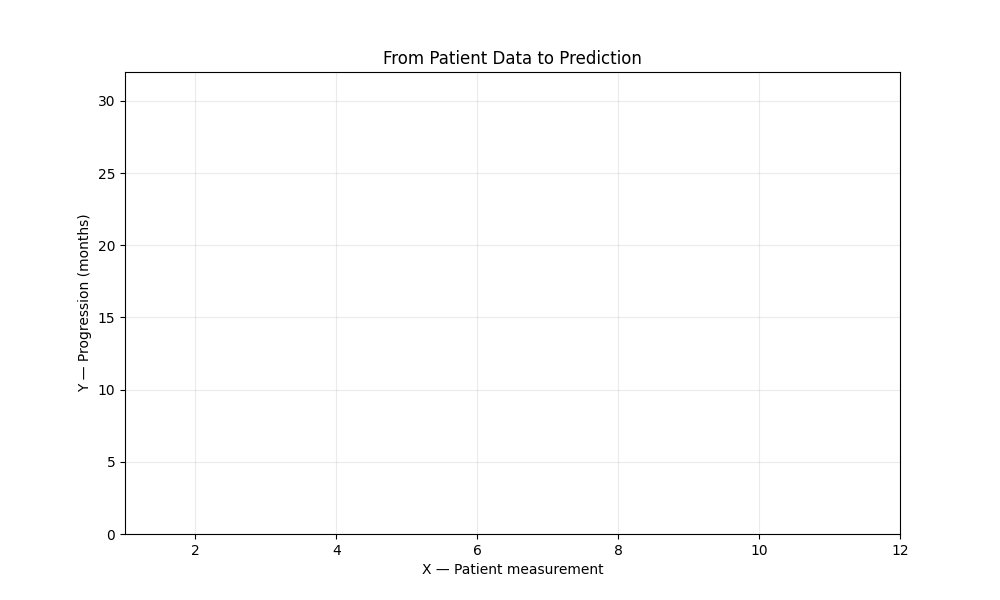
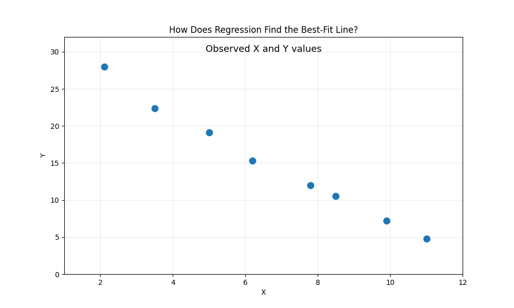
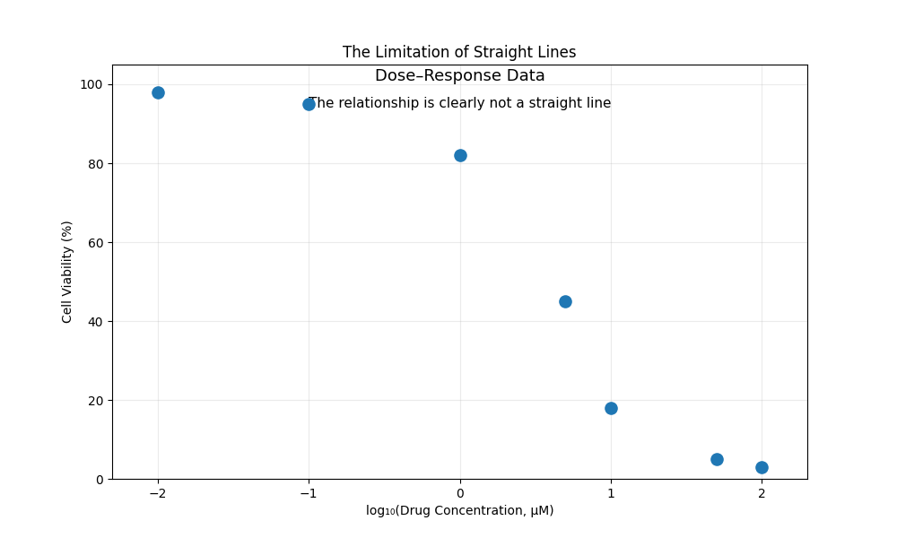

# 📈 Regression Models: Predicting Continuous Biological Measurements

We already know what regression is — using features to predict a continuous numerical value. In Unit 1, we built that foundation using a house-price example. Now we move to the real question: **how does the machine actually find the best prediction?**

This primer covers two regression algorithms:

```
                        REGRESSION MODELS
              (Predicting Continuous Biological Values)
                              │
           ┌──────────────────┴──────────────────┐
           ▼                                     ▼
    LINEAR REGRESSION                    POLYNOMIAL REGRESSION
  (Straight-Line Trends)              (Curved Biological Trends)
   • Best-fit line                     • Dose-response curves
   • Gene expression → survival        • Enzyme kinetics
   • Biomarker weight interpretation    • Saturation effects
```

---

## 📋 Session 09 & 10 Curriculum Roadmap: Regression Track

Supervised learning models learn mathematical mappings from input features ($\mathbf{X}$) to known ground-truth targets ($y$). In this track of our core supervised models curriculum, we master predicting **continuous quantitative outcomes**:

```text
┌───────────────────────────────────────────────────────────────────────────────────────────┐
│                        SESSIONS 09 & 10: REGRESSION CURRICULUM ROADMAP                     │
├───────────────────────────────────────────────────────────────────────────────────────────┤
│ 1. Foundations & Recap                                                                    │
│    • Supervised Learning paradigm: Feature matrix X → Continuous target vector y          │
│    • Linear relationship assumption vs. non-linear biological saturation kinetics         │
│    • Administrative: Submitting takeaway challenges via browser-based GitHub Issues       │
├───────────────────────────────────────────────────────────────────────────────────────────┤
│ 2. Core Theory (This Primer)                                                              │
│    • Linear Regression: Straight-line trends, residuals, OLS minimization, weights       │
│    • Multiple Regression: Multi-feature weights, biological interpretability (TP53/BRCA1) │
│    • Polynomial Regression: Biological saturation kinetics, feature expansion trick       │
│    • Diagnostic Evaluation: MAE, MSE, RMSE, and R² scores                                │
├───────────────────────────────────────────────────────────────────────────────────────────┤
│ 3. Hands-On Practical ([2.1_regression_models.ipynb](2.1_regression_models.ipynb))         │
│    • 1. Linear Regression:                                                                │
│         - Simple 1D Linear Regression (Oncogene Expression vs. Survival Months)           │
│         - Multiple Linear Regression (Multi-Gene Model: TP53, BRCA1, MYC)                 │
│         - Model equations, learned weights, and prediction visualizations                 │
│    • 2. Polynomial Regression:                                                            │
│         - Pharmacological dose-response curved assay                                      │
│         - Polynomial feature expansion: x → [x, x², x³]                                   │
│         - Capturing biological saturation kinetics vs. straight-line underfitting         │
├───────────────────────────────────────────────────────────────────────────────────────────┤
│ 4. Takeaway Deliverable                                                                   │
│    • Post completed code snippet, equation, and 2-sentence biological interpretation       │
│      as a new issue on the course GitHub repository                                       │
└───────────────────────────────────────────────────────────────────────────────────────────┘
```

---

## The Clinical Question

A patient arrives at an oncology clinic. We have their tumor's gene expression profile — measurements across hundreds of genes. We want to predict a continuous clinical outcome:

> **"Based on this patient's molecular profile, how many months of progression-free survival can we expect?"**

This is not a yes/no question. The answer could be 3.2 months, 14.7 months, or 38.5 months — a continuous number on a scale. We need a model that can output any value on that spectrum.

Other biological scenarios where we face this exact problem:
* **Pharmacology:** Predicting the exact $IC_{50}$ drug concentration (in $\mu M$) that kills 50% of cancer cells from genomic features.
* **Epigenetics:** Estimating a patient's biological age (in years) from DNA methylation levels across CpG sites — the foundation of an Epigenetic Clock.
* **Protein Engineering:** Predicting binding affinity ($K_d$ in nanomolar) of an engineered antibody from its amino acid sequence features.

---

## How Would We Do This by Hand?

Before introducing any algorithm, let us think about how we would approach this manually.

Suppose we have data from 8 previous patients, and for each one we know a single measurement — say, the expression level of a specific oncogene — along with how many months they survived after treatment:

| Patient | Oncogene Expression (X) | Survival Months (Y) |
| ------: | ----------------------: | ------------------: |
|       1 |                     2.1 |                28.0 |
|       2 |                     3.5 |                22.4 |
|       3 |                     5.0 |                19.1 |
|       4 |                     6.2 |                15.3 |
|       5 |                     7.8 |                12.0 |
|       6 |                     8.5 |                10.5 |
|       7 |                     9.9 |                 7.2 |
|       8 |                    11.0 |                 4.8 |

If we plot these 8 points on a scatter plot, we would see a clear downward trend — as oncogene expression increases, survival decreases. If a 9th patient arrives with an expression level of 7.0, we could place our finger on the X-axis at 7.0, look up to where the general trend sits, and read off the Y-axis: roughly 13 months.



That worked. We predicted survival for one new patient using nothing more than a visual trend line.

But now consider: a second patient walks in with an expression level of 4.3. We repeat the same process — finger on 4.3, trace up to the line, read off the Y-axis. Still fine.

Now imagine the hospital sends us **100 new patients**. Are we going to plot each one by hand, trace a line with our finger, and eyeball the Y value? What about 10,000 patients from a multi-site clinical trial?

We need a way to **express that trend line as a mathematical equation** — so a computer can do the finger-tracing for us, instantly, for any number of patients.

---

## Linear Regression: Drawing the Best Line Through Biology

### From Eyeballing to Equation: One Gene

The trend line we drew by eye is actually a straight line. Every straight line can be described by a simple equation we already know:

$$y = w \cdot x + b$$

Where:
* $x$ — the input measurement (oncogene expression level)
* $y$ — the predicted outcome (survival in months)
* $w$ — the **slope** (how steeply survival drops as expression increases)
* $b$ — the **intercept** (predicted survival when expression is zero — the line's starting point on the Y-axis)

For our oncogene-survival example, suppose the best line turns out to be:

$$\text{Survival} = -2.6 \times \text{Expression} + 33.1$$

Now if a patient arrives with expression = 7.0:

$$\text{Survival} = -2.6 \times 7.0 + 33.1 = 14.9 \text{ months}$$

No plotting required. No finger-tracing. The equation gives us an answer instantly — and it will give us the same answer whether we have 1 patient or 100,000.

### From One Gene to Many: Multiple Features

In our example, we used a single gene to predict survival. But in real bioinformatics, survival is rarely determined by one gene alone. What if **multiple genes** contribute to the outcome?

Suppose we measure three genes per patient:

| Patient | TP53 Expression ($x_1$) | BRCA1 Expression ($x_2$) | MYC Expression ($x_3$) | Survival (months) |
| ------: | ----------------------: | -----------------------: | ---------------------: | -----------------: |
|       1 |                     2.1 |                      5.8 |                    1.2 |               28.0 |
|       2 |                     6.2 |                      3.1 |                    4.5 |               15.3 |
|       3 |                    11.0 |                      1.9 |                    8.7 |                4.8 |

Each gene has its own influence on survival, so each gets its own weight:

$$\text{Survival} = w_1 \cdot x_1 + w_2 \cdot x_2 + w_3 \cdot x_3 + b$$

Or with actual hypothetical weights:

$$\text{Survival} = (-3.2 \times \text{TP53}) + (1.8 \times \text{BRCA1}) + (-2.5 \times \text{MYC}) + 40.0$$

Each weight tells us **how much that gene matters**: TP53 has a strong negative effect ($-3.2$), BRCA1 is protective ($+1.8$), and MYC is harmful ($-2.5$). The sign tells us the direction; the magnitude tells us the strength.

### The General Equation

With $p$ features (genes, biomarkers, clinical measurements), the pattern extends naturally:

$$y = w_1 x_1 + w_2 x_2 + \cdots + w_p x_p + b$$

This is often written in compact notation as:

$$y = \mathbf{w}^T \mathbf{x} + b$$

Where:
* $\mathbf{x}$ — a vector of all $p$ input features for one patient
* $\mathbf{w}$ — a vector of all $p$ learned weights (one per feature)
* $b$ — the intercept

This compact form is just shorthand — underneath, it is the same weighted sum we built step by step.

### How Does the Machine Find the "Best" Line? The Residuals

We said the equation gives us a line. But there are infinitely many possible lines we could draw through a scatter plot. How does the machine pick the best one?

For every patient in our training data, we can compare the model's predicted survival to their actual survival. The difference is called a **residual**:

$$\text{Residual}_i = y_i^{\text{actual}} - y_i^{\text{predicted}}$$




Linear regression finds the line that minimizes the sum of all squared residuals:

$$\text{Minimize: } \sum_{i=1}^{n} (y_i - \hat{y}_i)^2$$

Why squared? Squaring ensures that large errors are penalized much more heavily than small ones — a prediction off by 10 months counts 100 times worse than one off by 1 month. In clinical settings, this is exactly what we want: we care far more about catastrophically wrong predictions than slightly imprecise ones.

### What the Weights Tell Us About Biology

We already saw in our multi-gene example that each weight $w_j$ has a direct biological interpretation. This is worth formalizing because it is one of the most powerful reasons to use linear regression in bioinformatics.

Each coefficient answers a precise question:

> **"For every 1-unit increase in Feature $j$, how much does the predicted outcome change — holding all other features constant?"**

| Feature (Gene)       | Learned Weight ($w$) | Biological Interpretation                         |
| -------------------- | -------------------: | ------------------------------------------------- |
| `TP53_expression`    |               −3.2   | Each unit increase → 3.2 months *less* survival   |
| `BRCA1_expression`   |               +1.8   | Each unit increase → 1.8 months *more* survival   |
| `MYC_expression`     |               −2.5   | Each unit increase → 2.5 months *less* survival   |
| `CDH1_expression`    |               +0.9   | Each unit increase → 0.9 months *more* survival   |

The learned weights constitute a ranked list of candidate **biomarkers**, directly from the model's mathematics. Positive weights indicate protective factors; negative weights indicate risk factors.

> 💡 **Key insight:** In linear regression, the weights are not just numbers that make the math work — they are biologically interpretable quantities that tell us the direction and magnitude of each feature's association with the clinical outcome.

---

## When Biology Curves: Polynomial Regression

### The Limitation of Straight Lines

Linear regression assumes the relationship between features and outcome follows a straight line. But biological systems frequently violate this assumption.

Consider a classic pharmacological experiment — a **dose-response assay**:

| Drug Concentration ($\mu M$) | Cell Viability (%) |
| ---------------------------: | -----------------: |
|                         0.01 |                 98 |
|                         0.10 |                 95 |
|                         1.00 |                 82 |
|                         5.00 |                 45 |
|                        10.00 |                 18 |
|                        50.00 |                  5 |
|                       100.00 |                  3 |

At very low doses, the drug has almost no effect (viability stays near 100%). At medium doses, viability drops rapidly. At very high doses, the effect saturates — nearly all cells are dead, and adding more drug changes almost nothing.

A straight line cannot capture this S-shaped pattern. It would cut through the middle but miss the flat regions at both ends entirely.



### The Simple Trick: Creating New Columns

Polynomial regression solves this with a surprisingly simple mechanism. Instead of trying to fit a curve directly, we **create new features by raising existing ones to higher powers**:

$$x \longrightarrow [x, \; x^2, \; x^3]$$

Our original 1-column dataset becomes a 3-column dataset:

| Concentration ($x$) | $x^2$      | $x^3$         | Viability (%) |
| -------------------: | ---------: | ------------: | ------------: |
|                 0.01 |     0.0001 |      0.000001 |            98 |
|                 1.00 |       1.00 |          1.00 |            82 |
|                10.00 |     100.00 |       1000.00 |            18 |
|               100.00 |  10,000.00 |  1,000,000.00 |             3 |

Now we run standard linear regression on this expanded table. The model is "linear" with respect to the expanded features — but when we plot the prediction against the original concentration, it draws a smooth curve that follows the biological saturation pattern.

$$\text{Viability} = w_1 \cdot x + w_2 \cdot x^2 + w_3 \cdot x^3 + b$$

> 💡 **Key insight:** Polynomial regression is not a fundamentally different algorithm — it is linear regression applied to synthetically expanded features. We transform the input, then fit a straight line in the new feature space.

### The Overfitting Warning: When the Curve Follows Noise

If we use a very high polynomial degree (e.g., degree 15 for 20 data points), the curve can twist and bend to pass through every single training point perfectly — including the noise. This is **overfitting**: the model memorizes the training data instead of learning the true biological trend.

A degree-3 polynomial is usually sufficient for biological dose-response curves. In practice, we test multiple degrees and use cross-validation to select the one that performs best on held-out data.

---

## When Is Linear/Polynomial Regression the Right Tool?

### Use It When:
* The outcome is a continuous measurement (time, concentration, expression level, age, dosage).
* We want interpretable coefficients to understand *which features matter and by how much*.
* The relationship between features and outcome is roughly linear, or can be made so with polynomial expansion.

---

## Practical Scikit-Learn Implementation

In Python, Scikit-learn provides a unified API for linear and polynomial modeling. To prevent data leakage, polynomial feature expansion must always be encapsulated inside a `Pipeline`:

```python
import numpy as np
from sklearn.linear_model import LinearRegression
from sklearn.preprocessing import PolynomialFeatures
from sklearn.pipeline import Pipeline
from sklearn.metrics import mean_absolute_error, root_mean_squared_error, r2_score

# 1. Standard Linear Regression (Multi-Gene Model)
linear_model = LinearRegression()
linear_model.fit(X_train, y_train)

# Inspect learned biomarker weights
print("Biomarker Weights:", linear_model.coef_)
print("Baseline Intercept:", linear_model.intercept_)

# 2. Polynomial Regression (Dose-Response Kinetics)
# Encapsulate expansion and regression to prevent data leakage across CV folds
poly_pipeline = Pipeline([
    ('poly_features', PolynomialFeatures(degree=3, include_bias=False)),
    ('regressor', LinearRegression())
])
poly_pipeline.fit(X_train, y_train)

# 3. Model Evaluation on Held-Out Validation Split
y_pred = poly_pipeline.predict(X_val)
print(f"MAE:  {mean_absolute_error(y_val, y_pred):.2f} months")
print(f"RMSE: {root_mean_squared_error(y_val, y_pred):.2f} months")
print(f"R²:   {r2_score(y_val, y_pred):.3f}")
```

---

## Summary

```
  ┌─────────────────────────────────────────────────────────────────┐
  │                    REGRESSION MODELS RECAP                      │
  ├─────────────────────────────────────────────────────────────────┤
  │                                                                 │
  │  LINEAR REGRESSION                                              │
  │  • Finds the straight line minimizing squared residuals         │
  │  • Equation: y = w₁x₁ + w₂x₂ + ... + wₚxₚ + b                   │
  │  • Each weight wⱼ = interpretable biomarker importance          │
  │  • Positive weight → protective | Negative → harmful            │
  │                                                                 │
  │  POLYNOMIAL REGRESSION                                          │
  │  • Creates new features: x → [x, x², x³]                        │
  │  • Fits curves to capture saturation, dose-response, kinetics   │
  │  • Same algorithm underneath — linear on expanded features      │
  │  • Overfitting risk increases with degree — use cross-validation│
  │                                                                 │
  │  EVALUATION                                                     │
  │  • MAE: average error in original units                         │
  │  • MSE/RMSE: penalizes catastrophic mispredictions              │
  │  • R²: fraction of biological variance explained                │
  └─────────────────────────────────────────────────────────────────┘
```

---

## 📌 Hands-On Practical & Takeaway Deliverable

* **Interactive Notebook:** Transition to [2.1_regression_models.ipynb](2.1_regression_models.ipynb) to apply these algorithms directly in Python.
* **Challenge Deliverable (Submit via GitHub Issues):**
  Complete the takeaway exercise in [2.1_regression_models.ipynb](2.1_regression_models.ipynb):
  1. Open the course GitHub repository in your browser.
  2. Navigate to the **Issues** tab $\longrightarrow$ click **New Issue**.
  3. Title your issue: `[Takeaway] <Student Name> - Linear & Polynomial Regression`
  4. Post your completed code snippet, the learned model equation, and a 2-sentence biological interpretation of your learned weights or curve. Submitting directly through the browser ensures an auditable record of your laboratory milestones.

