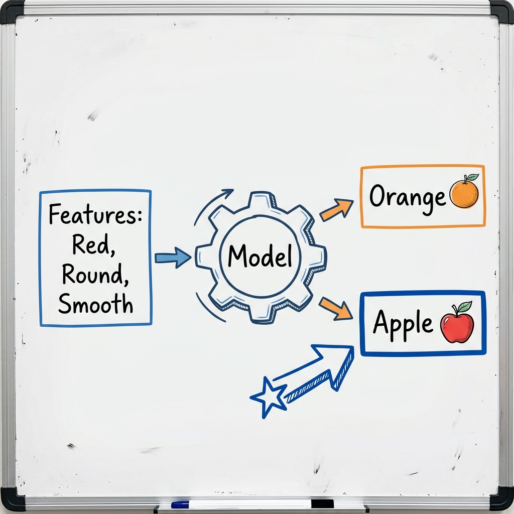
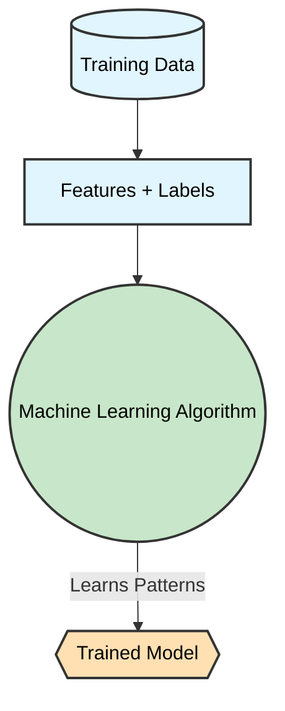
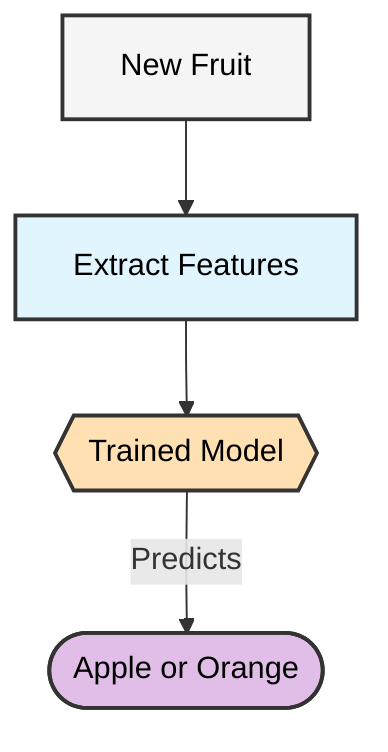
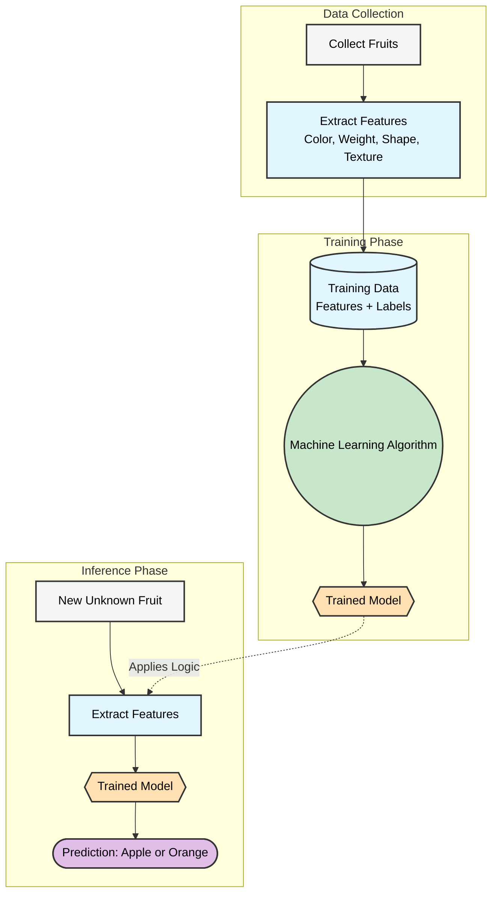

# Section 1 — How Do We Learn to Recognize Fruits?

<small><b>Course Code:</b> 02BMSBI24365 | <b>Program:</b> M.Sc. Bioinformatics (Semester III) | <b>Institution:</b> Garden City University (GCU) | <b>AI Tier:</b> Full AI (Learning Aid)</small>

---

### 1. The Problem

Imagine that we are handed a fruit and asked a simple question:

> **“Is this an apple or an orange?”**

As humans, we naturally look at the fruit and make a quick decision based on its physical characteristics.

### 2. What Do We Look At?

We rely on different attributes of the fruit to figure it out:
* **Color**
* **Size**
* **Weight**
* **Shape**
* **Texture**

In Machine Learning, these characteristics are called **features**.

> 💡 **Features** are the measurable properties (the clues) that help us make a decision.

### 3. Using Features to Make a Decision

Let's organize our observations into a structured table. Notice how the features line up:

| Color  | Weight | Shape | Texture | Smell  | ➡️ | Decision |
| ------ | -----: | ----- | ------- | ------ |:---:| -------- |
| Red    |  150 g | Round | Smooth  | Sweet  | ➡️ | **Apple**  |
| Orange |  180 g | Round | Rough   | Citrus | ➡️ | **Orange** |
| Green  |  140 g | Round | Smooth  | Sweet  | ➡️ | **Apple**  |

We look at these features and use them to identify the fruit.

### 4. What Is the Answer?

The final answer we are trying to predict (Apple or Orange) has a special name. 
This answer is called the **label** or **target**. 

### 5. Classification

Because our possible answers are predefined categories (**Apple** and **Orange**), we call these **classes**.

When we use features to determine which class a fruit belongs to, we are performing **classification**.

> 💡 **Classification** means assigning a new observation into one of our predefined categories.

---

### Human Learning vs. Machine Learning

**Humans** learn to distinguish an apple from an orange through life experience. By seeing, touching, smelling, and tasting many apples and oranges, we gradually learn they have different characteristics. We naturally notice apples are often smooth and red/green, while oranges are rough and orange-colored. We don't need to write down a math equation; our brain learns the pattern automatically.

**A machine** can also learn from examples, but it needs data instead of human senses. A machine is given measurable features (numbers representing color, weight, texture). When we provide many examples along with their correct labels (Apple or Orange), the **machine learning algorithm** finds the hidden mathematical patterns. It then builds a **model** capable of classifying brand new fruits!

In simple terms:
> **Natural learning:** Humans learn patterns from experience.
> **Machine learning:** Machines learn patterns from data.

---
# Section 2 — Connecting the Example to Machine Learning

Now consider the same problem from the perspective of a computer. 

Instead of manually writing a rule for every fruit (e.g., *"if red and smooth then apple"*), we just provide the computer with many examples of apples and oranges.

| Color  | Weight | Shape | Texture | Smell  | ➡️ | Label  |
| ------ | -----: | ----- | ------- | ------ |:---:| ------ |
| Red    |  150 g | Round | Smooth  | Sweet  | ➡️ | **Apple**  |
| Green  |  140 g | Round | Smooth  | Sweet  | ➡️ | **Apple**  |
| Orange |  180 g | Round | Rough   | Citrus | ➡️ | **Orange** |
| Orange |  170 g | Round | Rough   | Citrus | ➡️ | **Orange** |

The computer receives **features along with their correct labels**. This collection of historical examples is called **training data**.

### The Learning Phase

The algorithm analyzes the training data to find hidden patterns.

The **model** is simply the mathematical result of the algorithm learning patterns from the training data.

### The Prediction Phase

Now, when a brand new, unseen fruit is presented:

Because the model learned from examples where the correct labels were *already provided* by a teacher, this process is called **Supervised Learning**. And because the prediction is one of two distinct categories, this is specifically a **Classification** problem.

### The Complete Picture

Here is the entire end-to-end Machine Learning pipeline for our Apple vs. Orange problem. Notice how the colors and shapes remain consistent:

> 🎯 **Summary:** We used **Supervised Learning** to build a **Classification** model that maps physical **Features** to a predicted **Target Label**.
