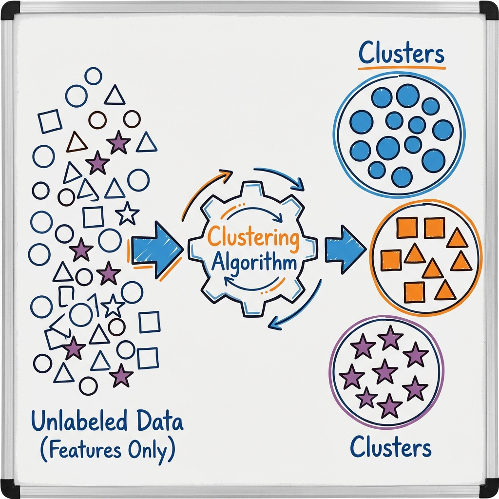
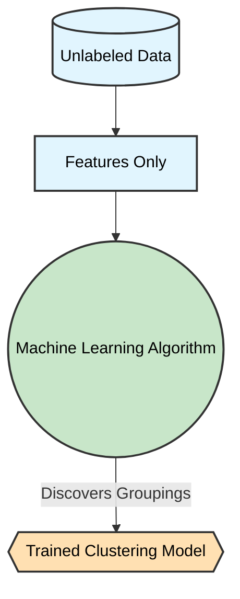
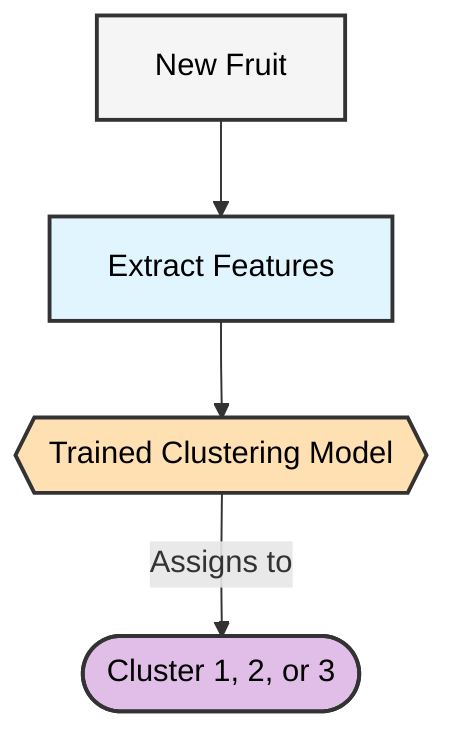
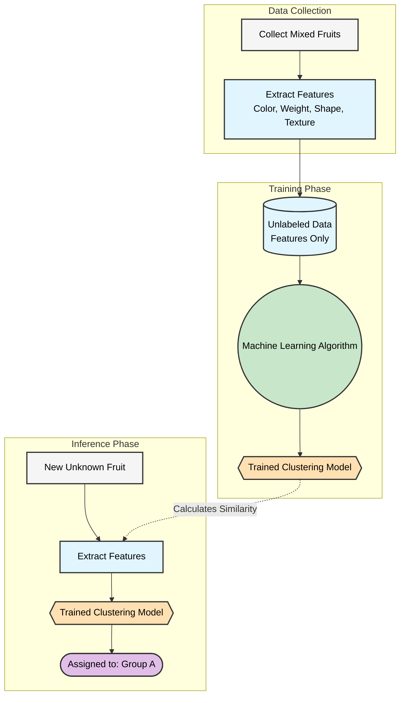

# Section 1 — How Do We Group Unknown Fruits?

<small><b>Course Code:</b> 02BMSBI24365 | <b>Program:</b> M.Sc. Bioinformatics (Semester III) | <b>Institution:</b> Garden City University (GCU) | <b>AI Tier:</b> Full AI (Learning Aid)</small>

---

### 1. The Problem

Imagine that we are handed a massive basket filled with hundreds of unfamiliar, exotic fruits. We don't know their names, and nobody is there to tell us what they are. We are asked a simple question:

> **“Can you organize these into logical groups?”**

As humans, we naturally start sorting them by putting fruits that look and feel similar next to each other.

### 2. What Do We Look At?

Even without knowing their names (labels), we can still observe their physical attributes:
* **Color**
* **Size**
* **Weight**
* **Shape**
* **Texture**
* **Smell**

In Machine Learning, these characteristics are called **features**.

> 💡 **Features** are the measurable properties (the clues) we use to find similarities.

### 3. Using Features to Find Patterns

Let's organize our observations into a structured table. Notice that this time, there is **no answer column**:

| Color  | Weight | Shape | Texture | Smell  |
| ------ | -----: | ----- | ------- | ------ |
| Red    |  150 g | Round | Smooth  | Sweet  |
| Yellow |  120 g | Long  | Smooth  | Sweet  |
| Orange |  180 g | Round | Rough   | Citrus |
| Yellow |  130 g | Long  | Smooth  | Sweet  |
| Red    |  145 g | Round | Smooth  | Sweet  |

We look at these features and notice that the red, round, sweet fruits seem to form one group, while the yellow, long fruits form another.

### 4. What Is the Answer?

Unlike our previous examples, **there is no predetermined answer.** There is no "teacher" telling us what the fruits are. We have **features, but no target labels**.

### 5. Clustering

Because we are grouping items based entirely on their feature similarities without any predefined categories, we are performing a specific task called **clustering**.

> 💡 **Clustering** means discovering hidden groupings or structures within data that has no labels.

In simpler terms, 
> 💡 **Clustering** identifies patterns of similarity among samples based on their features and groups similar samples together.

---

### Human Learning vs. Machine Learning

**Humans** learn to group objects naturally through intuition. If you dump a box of mixed Lego pieces on the floor, a child will automatically start sorting them by color or size, even if they don't know the exact names of the colors. Our brain naturally detects clusters of similar items.

**A machine** can also discover these groups using raw data. A machine is given measurable features (numbers representing the color, weight, and shape). Without ever being told what the fruits are, the **machine learning algorithm** calculates the mathematical "distance" between each fruit. It then builds a **model** that automatically separates the data into distinct, logical clusters!

In simple terms:
> **Natural learning:** Humans group things based on visual similarity.
> **Machine learning:** Machines group things based on mathematical similarity.

---
# Section 2 — Connecting the Example to Machine Learning

Now consider the same problem from the perspective of a computer. 

We provide the computer with our table of fruit measurements, but we do **not** provide any target labels.

| Color  | Weight | Shape | Texture | Smell  |
| ------ | -----: | ----- | ------- | ------ |
| Red    |  150 g | Round | Smooth  | Sweet  |
| Yellow |  120 g | Long  | Smooth  | Sweet  |
| Orange |  180 g | Round | Rough   | Citrus |
| Yellow |  130 g | Long  | Smooth  | Sweet  |

The computer receives **only features**. This collection of historical examples is called **unlabeled training data**.

### The Learning Phase

The algorithm analyzes the training data to find hidden clusters.

The **model** is the mathematical boundary that separates the different groups.

### The Prediction (Assignment) Phase

Now, when a brand new, unseen fruit is presented:

Because the model learned entirely on its own without a teacher providing the correct answers, this process is called **Unsupervised Learning**. And because it is finding groups, this is specifically a **Clustering** problem.

### The Complete Picture

Here is the entire end-to-end Machine Learning pipeline for our Unsupervised Clustering problem. Notice the absence of target labels:

> 🎯 **Summary:** We used **Unsupervised Learning** to build a **Clustering** model that finds hidden patterns in pure **Features** without needing a Target Label.
