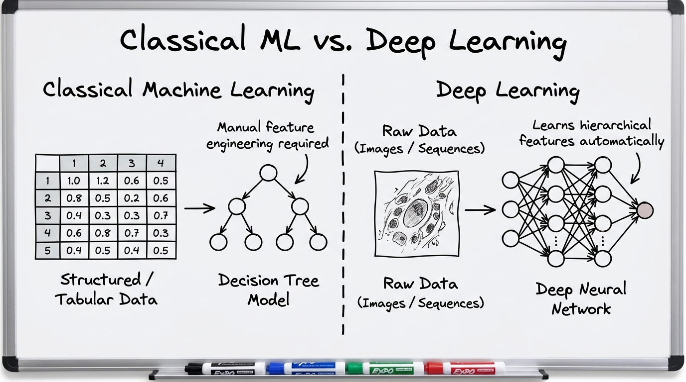
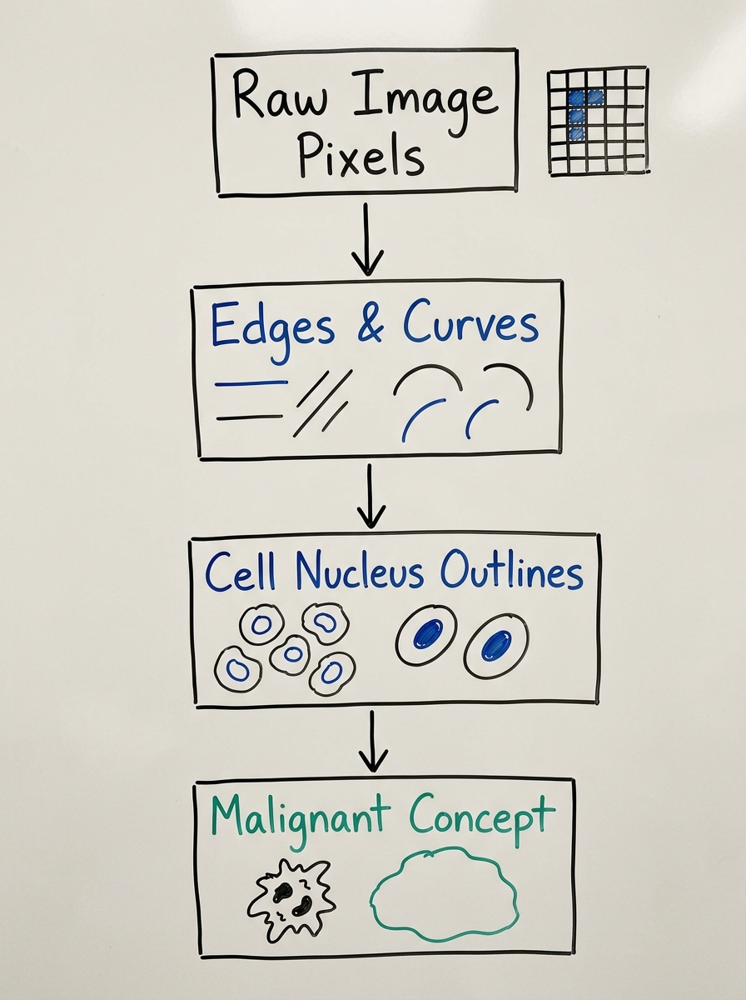
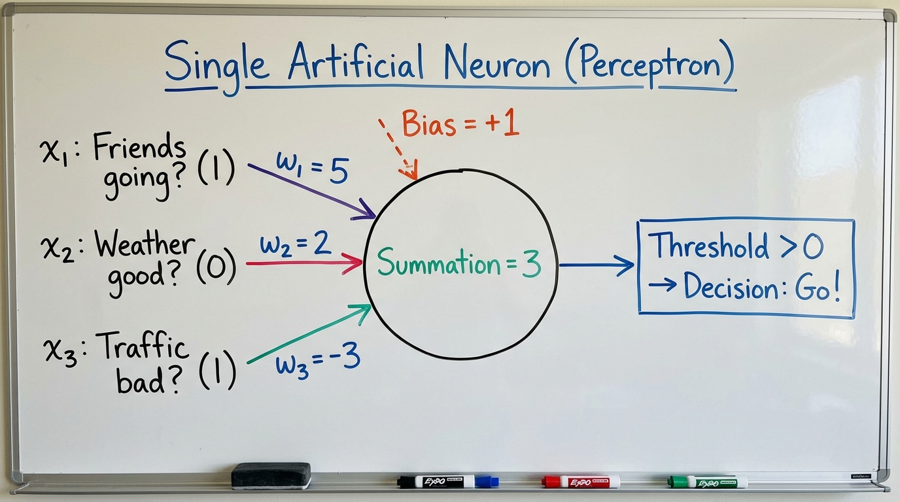
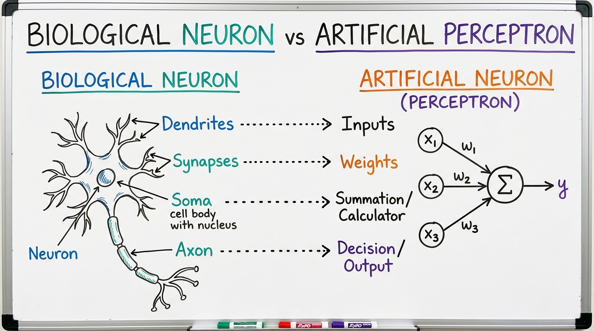
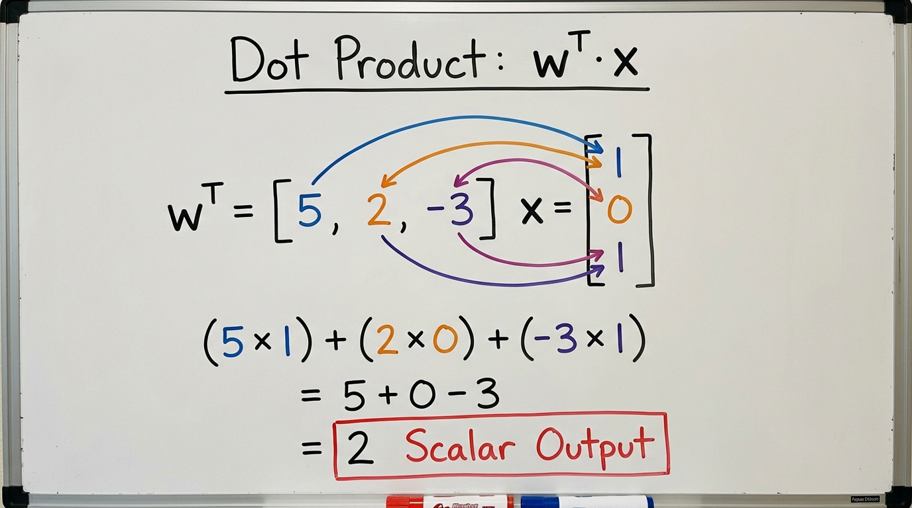
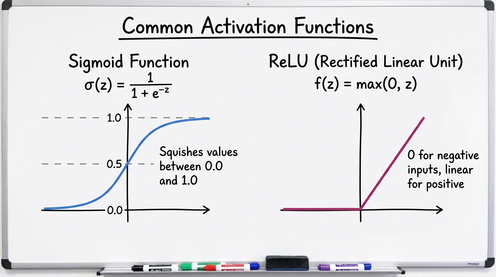
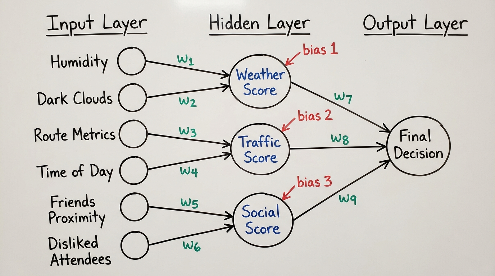

# 3.1 Basics of Artificial Neural Networks

## Why Classical Machine Learning Reaches a Limit

In classical machine learning (like Random Forests or Logistic Regression), the models rely on heavily summarized data. For example, when classifying Wisconsin Breast Cancer samples, the model requires clean, tabular spreadsheet columns like `Mean Radius` or `Concavity`. 

But where do those columns come from? A biological expert or pathologist must manually measure and summarize those features from a raw biopsy slide. 

If we attempt to build a Random Forest to classify a picture of a dog versus a cat, we hit the exact same problem. What do the columns look like? `ear_length`? `fur_color`? If a human engineer writes a rule like `ear_length > 3cm`, that rule immediately breaks if the dog is upside down or the image is zoomed in. Classical models are entirely blind to the raw image—they only know the neat summary table we feed them.

In modern bioinformatics, we do not have time to manually measure spreadsheets. We are dealing with raw, unstructured reality: gigapixel whole-slide histology images, continuous ECG waveforms, and strings of 3 billion DNA letters. We need models capable of **End-to-End Representation Learning**—models that can take raw data, figure out what is important on their own, and make a diagnosis.

To solve this, we can think of the solution like a sequence of filters or sieves building up complexity step-by-step:
1. **Basic Fragments:** The model sweeps over raw pixels and looks for basic contrasts (straight lines, curves, edges).
2. **Intermediate Shapes:** It combines those simple lines into shapes. In a biopsy image, it combines a curve and a line to form the circular outline of a cell nucleus.
3. **Complex Concepts:** It combines those shapes into full concepts (e.g., clustered, irregular, dense nuclei = Malignant Tumor).

To build a machine capable of this chained, step-by-step pattern recognition, computer scientists copied the ultimate pattern-recognition machine: the human brain. This brings us to **Artificial Neural Networks**.

---

## From Biology to Math: Modeling a Single Decision

To understand how a neural network works conceptually, let us look at a simple everyday decision. Suppose the weekend is coming up, and Mahesh heard that the annual Groundnut Fair (*Kadalekai Parishe*) is happening in Bangalore. Mahesh likes groundnuts, and is deciding whether to go (a decision of `1`) or stay home (a decision of `0`). This is a classic binary classification problem.

The decision depends on three external factors (the input features, $x$):
1. *Are friends going?* (Yes = 1, No = 0)
2. *Is the weather good?* (Clear = 1, Raining = 0)
3. *Is the traffic to the fair bad?* (Bad = 1, Clear = 0)

Not all factors matter equally to Mahesh. An importance multiplier (the weights, $w$) is applied to each input:
* Friends matter most ($w_1 = 5$).
* Good weather matters a little ($w_2 = 2$).
* Bad traffic is a deterrent, but not a dealbreaker ($w_3 = -3$).

Mahesh also has a baseline tendency. Because he generally loves fairs and groundnuts, he has an inherent bias ($b = 1$) towards going.

If his friends are going ($x_1=1$), the weather is raining ($x_2=0$), and the traffic is bad ($x_3=1$), his brain unconsciously processes this summation:
$$(1 \times 5) + (0 \times 2) + (1 \times -3) + 1 = 3$$

Mahesh's internal threshold to leave the house is a score greater than `0`. Since $3 > 0$, the decision triggers: Mahesh goes to the fair.

### The Biological Counterpart
This exact mathematical logic is how a single biological cell in the brain operates.
* **Dendrites (The Receivers):** These receive the input signals (checking the weather, hearing from friends).
* **Synapses (The Weights):** The strength of the junction. Excitatory signals get positive weights; inhibitory signals get negative weights.
* **Soma / Cell Body (The Calculator):** Physically sums up the incoming electrical charges, including the cell's resting potential (bias).
* **Axon (The Decision):** If the accumulated charge crosses a specific voltage threshold, the neuron fires an electrical spike (Action Potential). If it does not, it stays silent.

---

## The Mathematics of the Artificial Neuron

We refer to this mathematical simulation as an **Artificial Neuron**. The model calculates the expanded sum of individual inputs multiplied by their weights, plus the bias:

$$ \text{Score} = w_1x_1 + w_2x_2 + w_3x_3 + \dots + w_nx_n + b $$

This equation is identical to the foundation of Linear Regression. However, computing this individually $x_1$ through $x_n$ is inefficient. If we are diagnosing a patient using a gene expression panel of 20,000 genes, writing a 20,000-variable equation is impossible, and calculating it sequentially in code is too slow.

### Vectors and Dot Products
Instead, we stack all our Inputs into a single vertical column called $\mathbf{x}$, and we lay all our Weights flat into a single horizontal row called $\mathbf{w}^T$ (where "T" means Transpose).

Using our Groundnut Fair numbers:
$$ \mathbf{w}^T = \begin{bmatrix} 5 & 2 & -3 \end{bmatrix}, \quad \mathbf{x} = \begin{bmatrix} 1 \\ 0 \\ 1 \end{bmatrix} $$

Using Matrix Multiplication (the Dot Product), we align the row with the column, multiply the matching pairs, and sum the results simultaneously:
$$ (5 \times 1) + (2 \times 0) + (-3 \times 1) = 2 $$

Adding the single bias term ($b = +1$), we get the final score: $2 + 1 = 3$.

By packing inputs and weights into vectors, we shrink millions of mathematical operations into a compact, universal notation: **$\mathbf{w}^T \mathbf{x} + b$**. Modern computers (specifically GPUs) are engineered to process these packed matrix operations simultaneously in massive parallel bursts, which is precisely why neural networks can be trained rapidly.

---

## Converting Scores to Decisions: Activation Functions

While our fair equation yielded a score of `3`, "going to the fair" is a strict binary choice (Yes/No), not a continuous number. The equation $\mathbf{w}^T \mathbf{x} + b$ yields a raw, continuous score that can mathematically fall anywhere between $-\infty$ and $+\infty$. 

To map a score of `3` (or `3000`) securely to a "Yes", we apply a mathematical filter. As explored with Logistic Regression, we wrap our equation in the **Sigmoid Function**. This function "squishes" any raw score into a strict probability range between $0.0$ and $1.0$, where a threshold (e.g., $>0.5$) finalizes the binary classification.

In Deep Learning, these filters are formally called **Activation Functions**, as they evaluate the incoming score and dictate whether the neuron "activates." While Sigmoid is highly effective for calculating final probabilities, neural networks often employ different activation functions internally—such as **ReLU** (Rectified Linear Unit)—to solve different mathematical bottlenecks.

---

## Stacking Decisions: Network Architecture

Initially, a single neuron works perfectly when handed highly summarized, perfect features (e.g., "Weather is Bad = 1"). But in real life, nobody hands us clean pre-summarized data. 

Before we can confidently conclude "the weather is good," our brain processes raw environmental clues recursively: *Is the humidity high? Are the clouds dark? Is the wind blowing?* We have a specific subset of mental neurons dedicated solely to weighing these raw inputs just to pass forward a "Weather Score." 

Similarly, a separate cluster of neurons computes a "Traffic Score". They do not look at the sky; they only analyze raw transit metrics: *what route is being taken, is it rush hour, and are there known road closures?* Simultaneously, a third cluster computes a "Social Score" by weighing factors like *how close the inviting friends are, and if anyone Mahesh dislikes is attending.*

These three independent sub-decisions (Weather, Traffic, and Social) process their own distinct sets of raw clues in parallel. 

Here is the critical realization: every single one of those sub-factors—evaluating the humidity, scoring the rush hour, factoring the closeness of friends—acts as an individual neuron. By connecting and stacking these specialized neurons together so they feed their conclusions into one another, we can seamlessly break down and solve highly complex problems that a single mathematical equation never could. 

When we draw this interconnected web of sub-decisions, the structural mapping of nodes and connections looks nearly identical to an actual biological neural network in the human brain, which is exactly why we call this algorithm an **Artificial Neural Network**.

### Formalizing the Architecture

To construct this mathematically, we organize these chains into three distinct layers:

1. **The Input Layer:** The raw, unsummarized data entering the system (the dark clouds, the time of day, absolute temperature, or the raw pixels in a biopsy). These nodes do not make decisions; they just pass raw numbers forward.
2. **The Hidden Layers:** The intermediate sub-decision neurons. These neurons calculate the intermediate concepts (finding clinical edges, building nuclei, scoring "Weather"). We call them "hidden" simply because they operate in the background—they are stepping stones, not the final answer.
3. **The Output Layer:** The final judge. This neuron completely ignores raw inputs like humidity or pixels. It only listens to the highly processed conclusions from the hidden layers to make the final diagnosis using an Activation Function.

